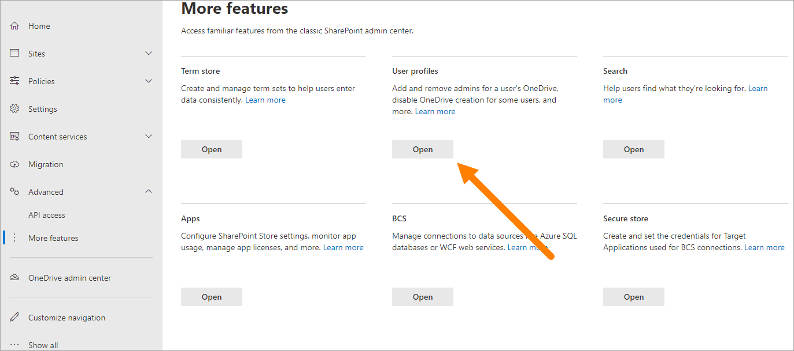
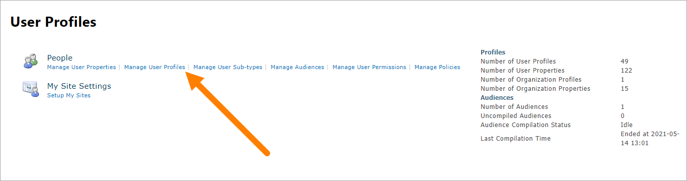

Mapping a user profile property
=====================================

**This description is outdated. Will be updated soon.**

In order to map an Omnia property to a user profile property, you need to first find the user profile property in Sharepoint. 

1. Go to the site.
2. Go to the admin portal (for example by typing https://admin.microsoft.com).
3. Select the Sharepoint admin center.

.. image:: sharepoint-admin-center.png

4. Select "User Profiles". If it's not shown, select "More Features" first.

4. Select "Manage User Profiles".

5. Type the name of the user you wish to inspect.

.. image:: sharepoint-admin-manage-profiles-user.png

In order for a user profile property to be used in Omnia, it has to be mapped first, and in order for it to be mapped, you need to know the name of the property, which can be found in search.

.. image:: sharepoint-admin-manage-profiles-search.png

1. Select "Manage Search Schema":

.. image:: sharepoint-admin-manage-manage-schema.png

2. Type in the name of the property you are looking for (example Department). 

.. image:: sharepoint-admin-manage-manage-schema-department.png

In this example you can see that the name of the Managed property is indeed Department, and the crawled properties are People:Department and ows_department.

Also notice that Department is of type Text, it is also queryable, retrievable and refinable but not searchable or sortable, which means that when you map it on omnia, it needs to have the same attributes if you want it have the same functionality.

Mapping in Omnia (example Department): 

.. image:: tenant-properties-mapping-new.png

Department is now a usable property that functions as both a value displayer and a refiner in blocks like People roll up and features like the search.

