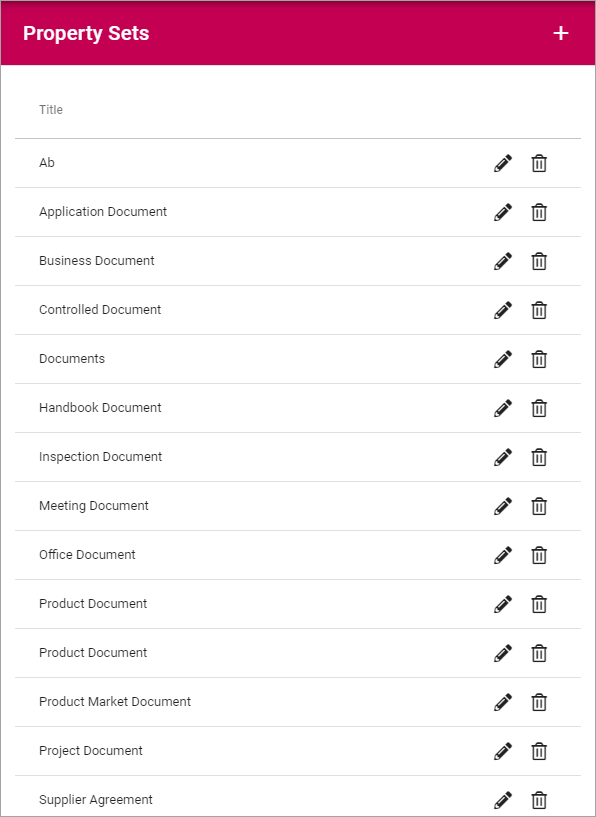
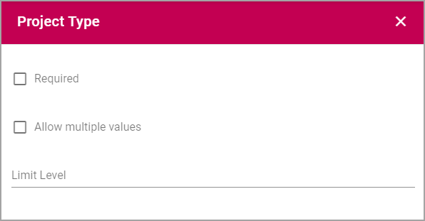
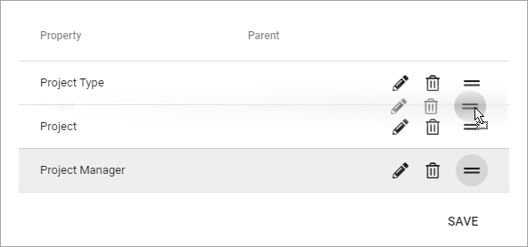

Property Sets (v6)
====================

**(This documentation is just started, more will be added/edited soon.)**

This is as the name says, an option where you can create sets of several Enterprise Properties and handle the set instead of each individual property. As a first step Property Sets is implemented for Controlled Documents.

A list of useful Property Sets can already be in place, for example:

To edit a Property Set, click the pen. To delete a Property Set, click the dust bin.

When you edit a Property Set, something like the following can be shown:

.. image:: property-sets-edit.png

This set consists of two Properties; Document Owner and Office.

The settings are used the same way as when creating a new set, see below.

Creating a new Property Set
*****************************
To create a new Property Set, do the following:

1. Click the plus.

.. image:: property-set-click-plus.png

Use the following settings:

.. image:: property-set-settings.png

2. Add a Title for the Property Set. You can add a title in all langauges active in the tenant. Default language is mandatory.
3. Open the list and select a Property.
4. Click "Add".

.. image:: property-set-add.png

5. Set additional settings for the Property, if required.

6. Continue the same way until you have added all the properties for the set.
7. To change the order, grab a property by the icon to the far right, and drop the property where you want it.

8. When you're finished, click "Save".

.. image:: property-set-save.png
