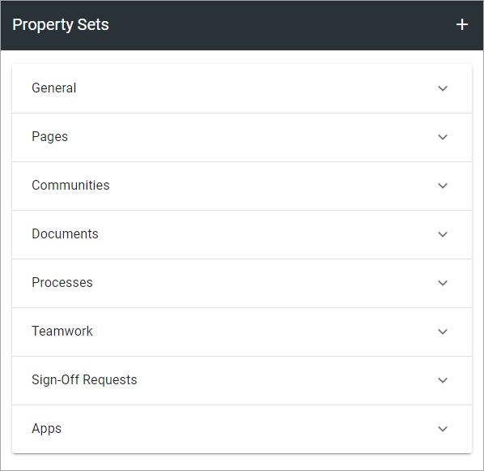
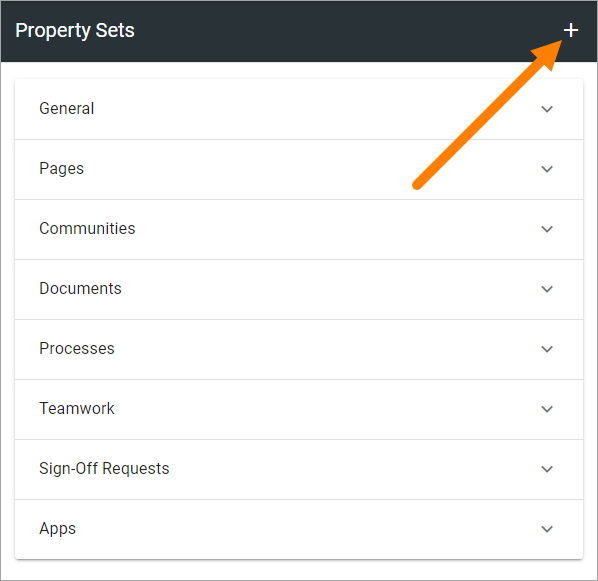
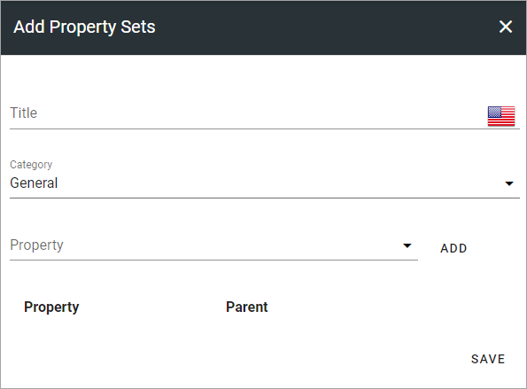
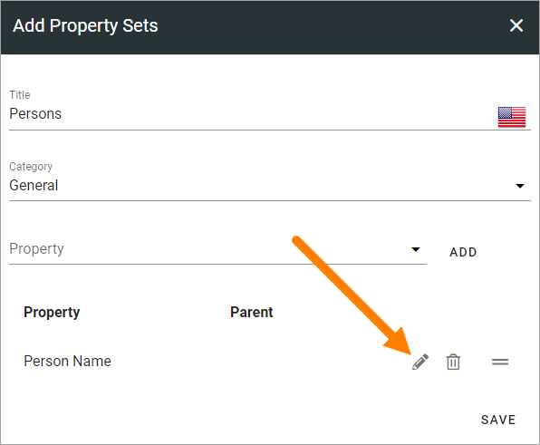
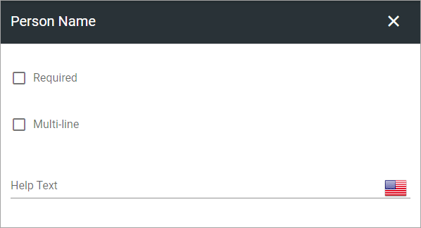
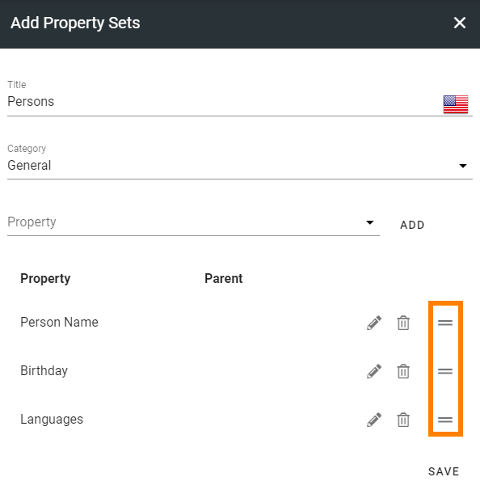
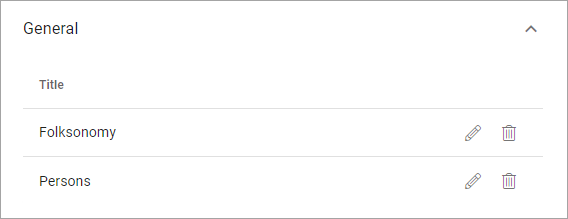
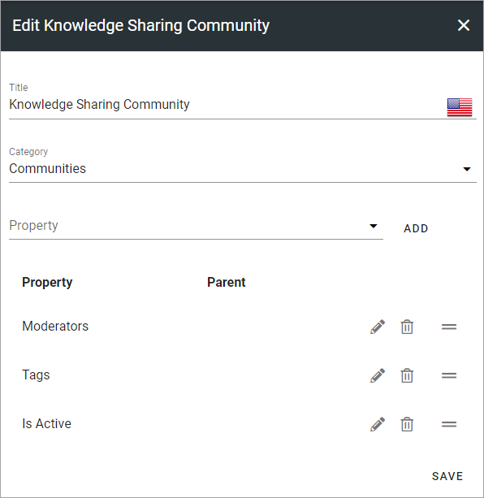

Property Sets
====================

This is as the name says, an option where you can create sets of several Enterprise Properties and handle the set instead of each individual property. 

A list of useful Property Sets can already be in place, sorted after Type, for example:

Creating a new Property Set
*****************************
To create a new Property Set, do the following:

1. Click the plus.

Use the following settings:

2. Add a Title for the Property Set. You can add a title in all langauges active in the tenant (click the flag to change language). Default language is mandatory.
3. Change category if needed.
4. Open the list and select a Property.
5. Click "Add".
6. Set additional settings for the Property, if required, by clicking the pen:

Here's an example of the settings that can be available:

Available settings depend on type of property. Here's some common examples:

+ **Required**: If this Property must be filled in, select this option.
+ **Allow multiple values**: If it should be possible to select more than one value in this field, select this option. Available for applicable fields only.
+ **Limit Level**: For a property that can contain several levels - for example Country, City, Office etc - you can limit the levels to choose from here.

7. Continue the same way until you have added all the properties for the set. (Click the dustbin to remove a property if needed).
8. To change the order, use the icon to the far right, and drag and drop.

9. When you're finished, click "Save".

Edit or delete a Property Set
***********************************
To edit a Property Set, click the pen. To delete a Property Set, click the dust bin.

Note that a deleted Property Set is not deleted right away. It is placed in the Property Recycle Bin. For more information see: :doc:`Property Recycle Bin </admin-settings/tenant-settings/properties/recycle-bin/index>`

When you edit a Property Set, something like the following can be shown:

The settings are used the same way as when creating a new set, see above.

