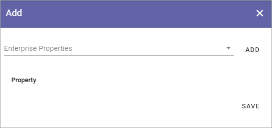

Queryable Properties
===========================

Three lists are available here:

.. image:: queryable-all.png

In these lists, you add Properties that should be queryable in Omnias database. The Properties are used in the Query Builder, so far in these blocks:

+ **App Instances**: In Teamwork Rollup.
+ **Pages**: In Page Rollup.
+ **Processes**: In Process Rollup.

To be available here, a property must first be added to Enterprise Properties. 

The lists are handled the same way. Here's part of the list for App Instances as an example:

.. image:: queryable-app-instances-612.png

To remove a Poperty from this list, click the dust bin.

To add a Property, do the folllwing:

1. Click the plus.

This is then shown:

2. Select an Enterprise Property in the list and click ADD.
3. Save when you're done.

