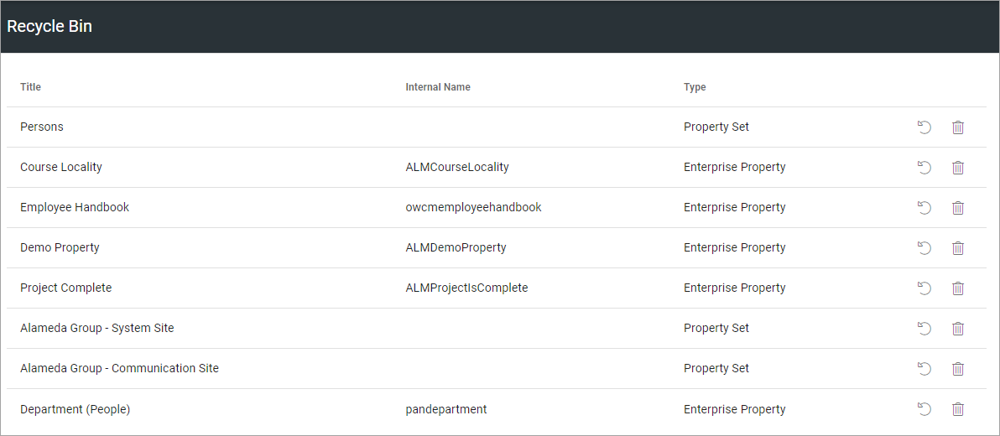
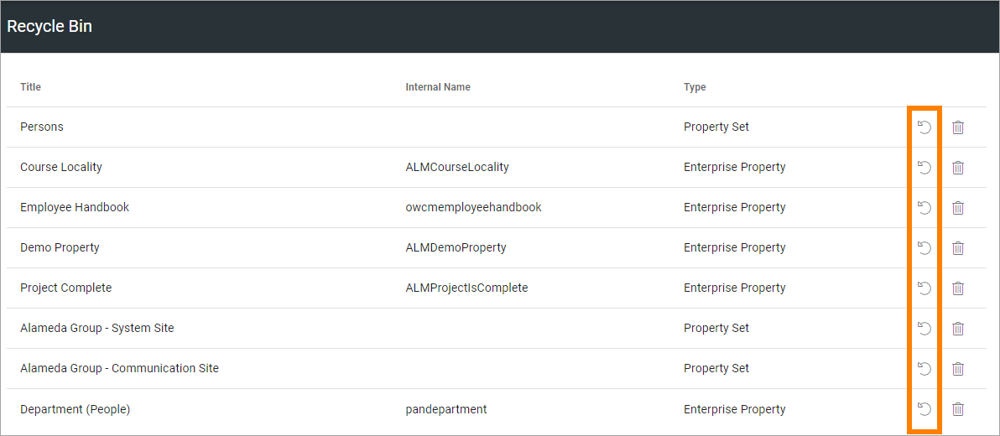
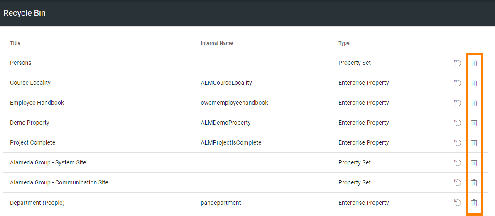

Property Recycle Bin
=========================

You can delete some Properties from the various lists in Omnia Admin. You can also delete property sets. Normally you can just delete those your organization has added. Default properties can not be deleted.

When a property is deleted it is moved to the Property Recycle Bin. If that property is used somewhere in Omnia, it's still available until you terminate it from the recycle bin. 

This is an example of a list of properties in the Property Recycle Bin:

Here you can decide what to do with them. To restore a property so it can be edited, click this icon:

To terminate a property, click this icon:

Note that when you terminate a property, it's truly and finally removed from Omnia. It can no longer be used anywhere, and there's a risk that current implementations using the property will be broken.

