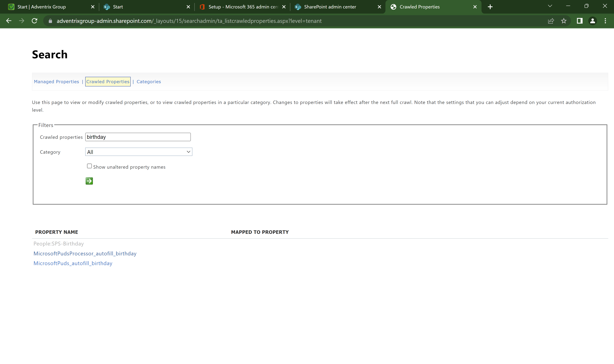
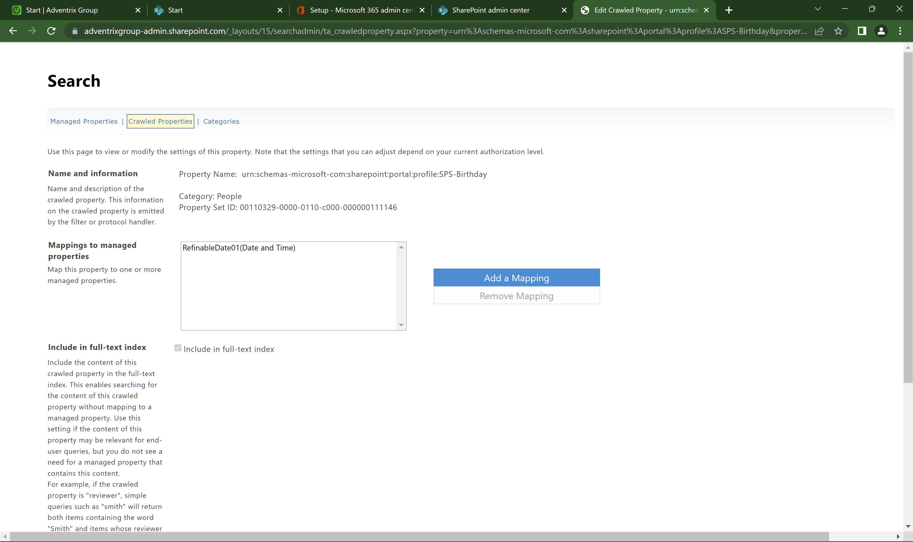

Setting up a birthday property
=============================================

**More details will be added in a while.**

To be able to use a property for birthdays in rollups, a birthday property must be available in Omnia.

There is a birthday property available in Sharepoint and it is used for the birthday information on the People card. The Sharepoint property can not be used for the rollups, though.

You need to set up a managed birthday property connected to a refinable date.

Here's how to set up a birthday property in Omnia:

(Will be added soon).

.. image:: birthday-property-3.png

.. image:: birthday-property-4.png

.. image:: birthday-property-5.png

