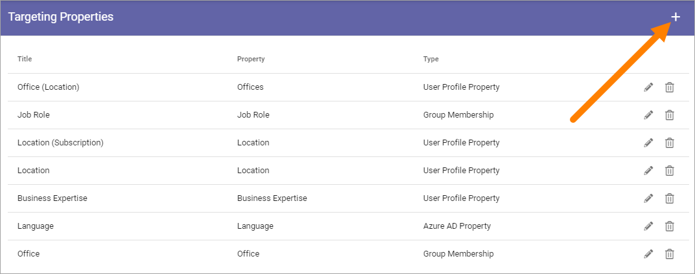
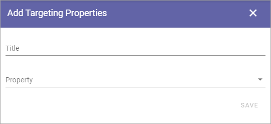
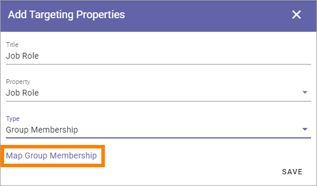

Targeting Properties
===========================

Here you define which Properties to use for Targeting. 

.. image:: targeting-properties-v6.png

The Properties must be added to Enterprise Properties to be able to be selected here, as well as be of the type "Taxonomy".

**Note!** Term sets to be used as properties for targeting in Omnia, must be set to "Available for tagging" in Sharepoint.

**Note!** In Omnia on-prem, it's possible to target using SharePoint User Profile and Windows Active Directory group membership only. 

Add a Target Property
***************************
To add a Target Property definition, click the plus:

Use the following settings:

+ **Title**: Add the Title to be shown for editors, for the Property, when targeting.
+ **Property**: Select Tenant Property from the list.
+ **Type**: Select Type of targeting for this Property; Group Membership, User Profile Property or Azure AD Property. When "User Profile Property" or Azure AD Property is selected, choose Property from the list shown.

Map Group Membership
************************
When "Group Membership" is selected, this link is shown:

When you click the link, the term set for the property you have selected is displayed. Here's an example for "Job Role":

What you do here is to map terms from he term set, to groups. You don't need to map all, if you don't need all.

1. Click the term you want to map.
2. Select a group in the list by searching (type beginning of a group and see what pops up).

.. image:: targeting-properties-settings-map-v6-group-list-new.png

Security groups and Microsoft 365 groups can be added here (In Omnia on-prem, Microsoft 365 groups can’t be used). Även distríbutionslsitor kan väljas.

3. Continue this way until all terms you want to map is done. 
4. Save when you're finished.

Delete or edit Target Property
**********************************
To delete a Target Property, click the dust bin, to edit it, click the pen:

.. image:: targeting-properties-delete-edit-v6.png

All settings used when creating a Targeting Property can be edited, see above.
