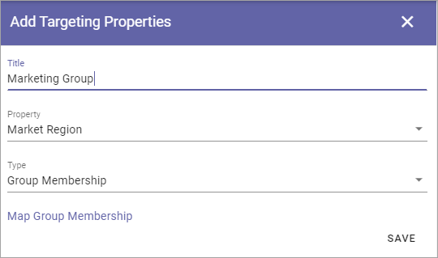

Targeting Properties
===========================

Here you define which Properties to use for Targeting. 

.. image:: targeting-properties-v6.png

The Properties must be added to Enterprise Properties to be able to be selected here, as well as be of the type "Taxonomy".

**Note!** Term sets to be used as properties for targeting in Omnia, must be set to "Available for tagging" in Sharepoint.

Add a Target Property
***************************
To add a Target Property definition, click the plus:

.. image:: targeting-properties-click-plus-v6.png

Use the following settings:

.. image:: targeting-properties-settings-v6.png

+ **Title**: Add the Title to be shown for editors, for the Property, when targeting.
+ **Property**: Select Tenant Property from the list.
+ **Type**: Select Type of targeting for this Property; Group Membership, User Profile Property or Azure AD Property. When "User Profile Property" or Azure AD Property is selected, choose Property from the list shown.

Map Group Membership
************************
When "Group Membership" is selected, this link is shown:

How to map Group Memebership is explained on this page: (link to be added)

Delete or edit Target Property
**********************************
To delete a Target Property, click the dust bin, to edit it, click the pen:

.. image:: targeting-properties-delete-edit-v6.png

All settings used when creating a Targeting Property can be edited, see above.