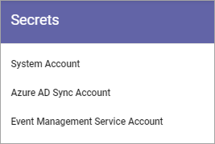
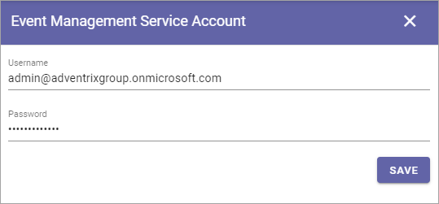

Permissions
===========
The following settings are found here:

.. image:: security-tenant-new2.png

(In previous Omnia versions, this menu option was called Security).

Users and Groups
*******************
Use this setting to add and remove Tenant Administrators. Only Tenant Administrators can use this setting and other settings under "Tenant" in Omnia Admin. 

A Tenant Administrator can also edit all the settings for all Business Profiles within the Tenant. 

.. image:: tenant-permissions-new2.png

To delete an administrator here, just click the x. To add an administrator, add the name the same way as in other name fields.

External users that has been invited in the Azure AD can be added here as well. Users invited this way can log in with their own Microsoft 365 account.

**Note!** There must always be at least one Tenant Administrator. If there is only one, that administrator can not be removed until an additional one has been added.

Secrets
********
The following settings can be available here:

System Account
------------------
System account is a standard extension for specialized implementations only, normally used by developers.

.. image:: tenant-secrets-system.png

Azure AD Sync Account
-----------------------
If you're using Azure AD Synchronization, add the account that executes the scheduling here. Should be a Sharepoint Admin account.

.. image:: tenant-secrets-sync.png

For more information about Azure AD Synchronization, see: :doc:`Azure AD Synchronization Settings </admin-settings/tenant-settings/azure-ad-synchronization-settings/index>`

Event Management Service Account
----------------------------------

If you will be using Event Management with a connection to calendars in Outlook, you must add the service account that will be used to read and write from the calendars in the tenant. (Don't forget that this account needs permissions to that calendar.)

