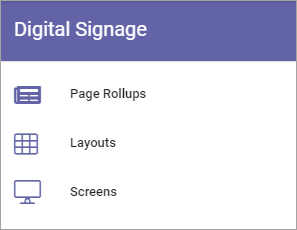

Digital signage in Omnia 6.13
=============================================

**Work on this part of the documentation has just started. Will be finished soon.**

he following options are available for Digital Signage in Omnia 6.13 and later. 

For options in Omnia 6.12 and earlier, see: :doc:`Digital signage </admin-settings/tenant-settings/settings/digital-signage/index>`

Prerequisite: the feature Digital Signage must be activated.

Select option for more information:

.. toctree::
   :titlesonly:

   page-rollups-digital-signage/index
   layouts-digital-signage/index
   screens-digital-signage/index

