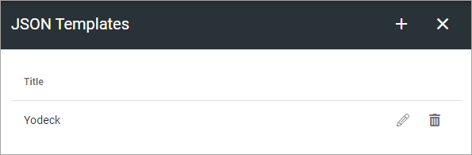
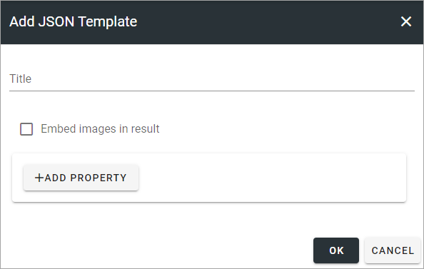
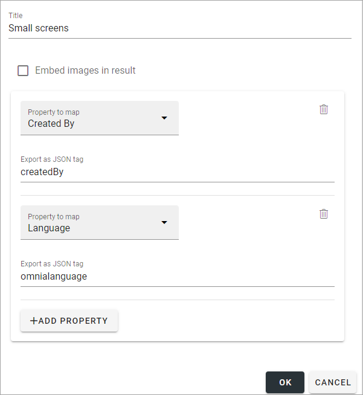

JSON templates
=============================================

Here you can set up JSON templates to use for Digital Signage.

As ususal, use the pen to edit or the dust bin to delete.

Create a new template
**************************
Use these setting to create a new JSON template:

Add a title, decide if images should be added to the result and one or more properties, for example:

Save the template by clicking OK when you're done.

