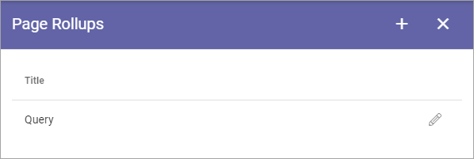
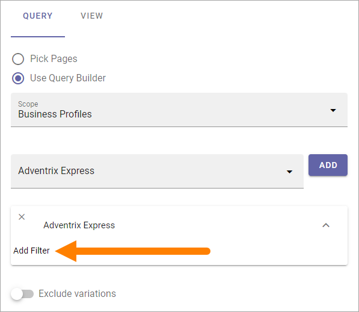
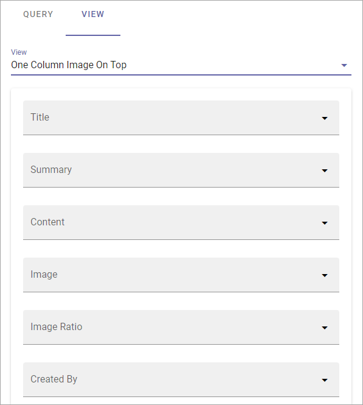

Page Rollups (Digital Signage)
=============================================

**Work on this page has just started. Will be finished soon.**

Here you set up rollups to be used for digital signage. The list displays rollups that has been set up so far, for example:

When you click the plus to create a new rollup, the following settings are available:

.. image:: rollups-signage-settings.png

(All options are not shown in the image).

Add a title for the rollup at the top and use the tabs for settings:

QUERY
*******
You work with these settings in a similar way to those in the Page Rollup block.

+ **Pick Pages**: If the editor should be able to pick pages from a list, select this option.
+ **ADD PAGE**: When you have selected Pick Pages, you can pick some pages to always be shown. Click this option and use the Page Picker. See this page for more information: :doc:`Page Picker </general-assets/page-picker/index>`
+ **Use Query Builder**: If you want to use the query builder to set which pages should be available here, select this option.

For Query Builder, the following options are available:

+ **Scope**: When you have chosen to use the Query Builder, select scope for the block. This is where you choose where to get the pages from. You can select:

  + Tenant.
  + Business Profile(s).
  + Publishing App(s).
  + Page Collection(s).
  + Navigation Path.
  + Channel(s).

When you have selected Business Profiles, Publishing Apps, Page Collections or Channels, as the next step, you select one or more to get the pages from, just as you would in the Page Rollup block. 

If you select Tenant, Business Profile or Publishing Apps as the scope you can add filters for what you want to display in the list, see below.

The following settings can then be available, depending on scope chosen:

+ **SELECT START NODE**: Available for scope Navigation path. Choose the start point for the navigation path to be displayed. If you select "Custom", you can use the Page Picker to select start node.
+ **Exclude start node**: Available for scope Navigation path. If the start page selected should not be displayed in the block, select this option.
+ **Exclude variations**: Usings this option, you can exclude varations from the query. Not available for Navigation path.
+ **Trim duplicates**: If more than one Rollup is added to a layout, this option can be used to handle duplicates between the blocks. When the option is selected, you can enter a number indicating the priority for duplicates, for this block. If you set "1" for a block it means this block has priority showing a post that would have been a duplicate. 
+ **Like, Comment, Rating**: Use these settings to decide the time period calculated for any of these options. If you don't select anything, it means "No Limit". You can select one week, two weeks or one month instead.
+ **Navigation Depth Level**: Available for scope Navigation path. Choose the number of nodes that should be displayed, including the start node.
+ **Item Limit**: Type the number to set the number of pages that should be retrieved to make sure all duplicates are found. You should not set this number higher than you really need, as higher numbers may have an impact on performance. Note that when you change the number, "Max Display Limit" is also changed, see below.
+ **Sort by**: Select a property to sort the list by, and then choose Ascending or Descending.

Filter on Tenant
----------------
When you have selected Tenant as the scope, you can add filters for what you want to display, bu clicking here:

.. image:: rollups-signage-settings-tenant.png

Filter on Business Profile or Publishing App
----------------------------------------------
When you have selected Business Profile or Publishing Apps as the scope, and added one or more, you can add filters for what you want to display for each selected, by clicking here:

VIEW
******
Use this tab for view settings, similar to those in the Page Rollup block:

(Not all options are shown in the image, but described below.)

