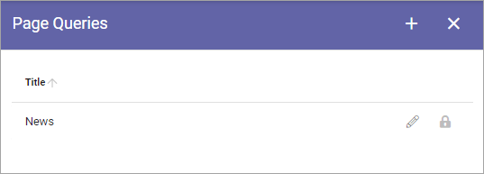
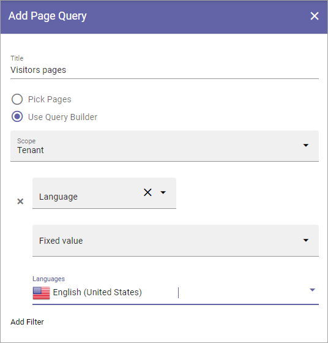
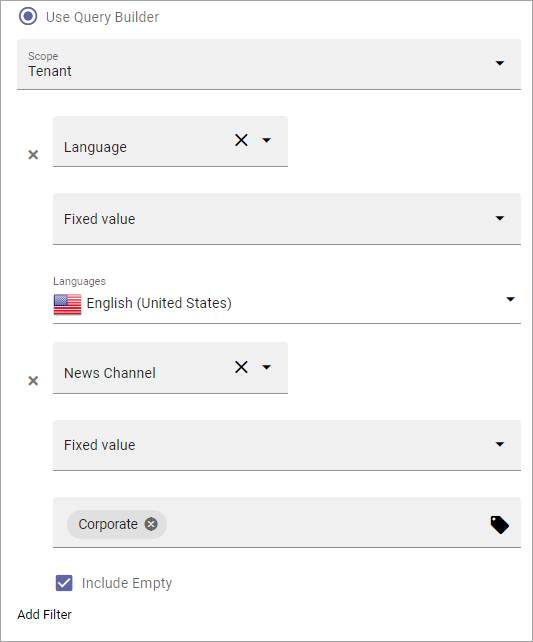
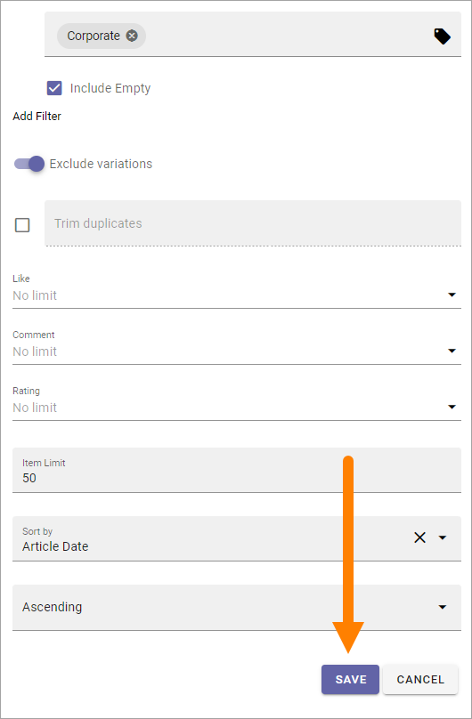

Page Queries
=====================================

Here you set up the page queries to be used for the different screens you're using. It can be seen as a variant of a Page Rollup, although here you set the views under JSON Views or HTML Views respectively.

The first you see is the list of Page Queries that has been created so far, for example:

To edit a query, click the pen. To add a new query, do the following:

1. Click the plus.
2. Use the folllowing settings (don't forget to save when you're done):

.. image:: page-queries-settings.png

+ **Title**: Add a title for the query. Will be used when selecting query for a screen.
+ **Pick Pages/Use Query Builder**: You can either pick one or more pages to be shown, or add a query.
+ **ADD PAGES**: If you choose to pick pages, click this button and use the Page Picker to pick one or more pages. For more information, see: :doc:`Page Picker  </general-assets/page-picker/index>`
+ **Scope**: If you choose to use the Query Builder, the first setp is to select scope for the query; Tenant, Business Profile, Publishing Apps, Page Collections, Navigation Path or Channels.
+ **Add Filter**: If you select Tenant as scope you can add a filter. For more information, see below.
+ **Business Profile**: If you choose Business Profile as scope, select a business profile from the list and click ADD. If you want to add several business profiles, just repeat the process. For eaach business profile you can add a filter.
+ **Publishing Apps**: If you choose Publishing Apps as scope, select a publishing app from the list and click ADD. If you want to add several, just repeat the process. For eaach publishing app you can add a filter.
+ **Page Collections**: If you choose Page Collections as scope, first select a publishing app and then select a page collection from the list and click ADD. If you want to add several, just repeat the process. For eaach pagew collection you can add a filter.
+ **SELECT START NODE**: If you choose Navigation Path as scope, you click this button and use the Page Picker to pick a start node. See link to the Page Picker description above.
+ **Channels**: f you choose Channels as scope, select a channel from the list and click ADD. If you want to add several, just repeat the process. For each channel you can add a filter.
+ **Navigation Depth Level**: Available when you choose Navigation Path as as scope.
+ **Trim duplicates**: If a query could result in one page being listed more than once, select this option to make sure it's only listed once.
+ **Like/Comment/Rating**: If just the latest likes, comments or ratings for a page should be shown, you can select to show the ones from the last week, from two weeks or a month.
+ **Item Limit**: Set the item limit to display in each “page” of the list.
+ **Sort by**: Choose the property to sort by, then select Asecending or Descending.

Adding filters and save the page query
******************************************
If you choose to list pages using the Query Builder, and select Tenant as Scope, you can add filters for the pages you want to display.

Do the following:

1. Cick "Add Filter".

.. image:: click-add-filter.png

2. Open the list and select a property.

.. image:: click-add-filter-property.png

3. Add settings for the property as needed, as in this example for Language, where only pages in American English should be used:

4. Continue the same way until all filters are added.

Here's an example where only Corporate News pages in American English should be used:

5. Set all other settings for the page query as needed.
6. Click SAVE.

