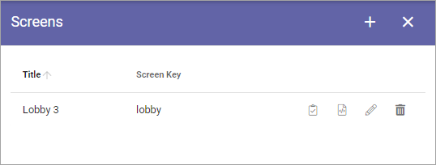
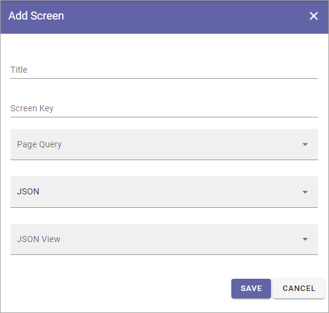

Screens (Digital Signage)
=====================================

Here you set up the different screens you're using and select the settings suitable for each.

The first you see is the list of Screens that has been created so far, for example:

Use the icons to (from left to right):

+ Show the Url for the screen.
+ Launch a preview.
+ Edit the screens settings.
+ Delete the screen.

When you edit a screens settings, all settings described below can be edited.

Add a new screen
**********************
To add a new sreen, do the following:

1. Click the plus.
2. Use the folllowing settings:

+ **Title**: Add a title for the screen. Not shown for users.
+ **Screen Key**: Here you can add an internal, unique name/id for the screen.
+ **JSON/HTML**: Set if view settings used for this screen is JSON or HTML.
+ **JSON View/HTML View**: Select the view to use for this screen.

JSON views/HTML views are set up using the options in the main Digital Signage menu.

