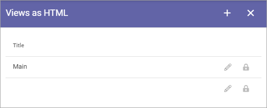
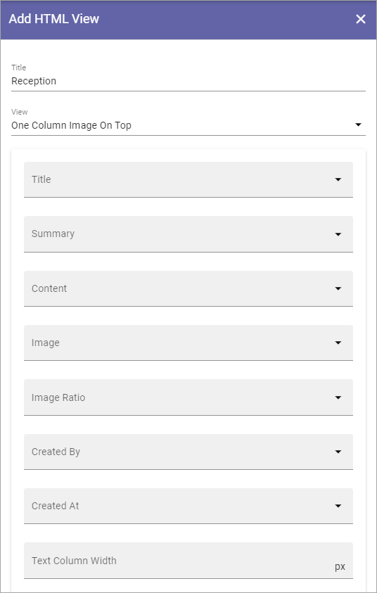

View as HTML in Omnia 6.12
===================================

The first you see is the list of views that has been created so far (just one in this example):

To edit a view, click the pen. When editing a view all settings described below can be edited.

To add a new view, do the following:

1. Click the plus.
2. Add a  title (used when chosing a vew for a screen settings).
3. Select type of View (you must always do this even if just one view is available).

When you have done that, the rest of the settings are shown:

and these:

.. image:: page-view-html-settings-612-2.png

4. For the seven topmost fields, you select the property to get the information from. Just open the list and select property.
5. Use the other settings this way:

+ **Delay Time Before scroll (seconds)**: Set the delay time before next scroll.
+ **Scrolling Speed**: Use the slider to set speed of the scroll.
+ **Delay Time after scroll (seconds)**: Set the delay time after a scroll.
+ **Scrolls Whole Page**: Select this if you want the whole page to scroll.
+ **Show Likes/Comments**: Select if Page Likes and Comments should be shown on the screen.
+ **Logo Logo**: To display a logo, select the option and add the url here.
+ **Logo Position**: Available when "Show Logo" is selected. You can choose to display the logo Top Right, Bottom Right, Top Left or Bottom Left.
+ **Logo Size**: Available when "Show Logo" is selected. Use the slider to set logo display size.
+ **Show Indicator**: Select this option to display an indicator.
+ **Indicator Position**: Available when "Show Indicator" is selected. You can chose to display the Indicator Top Right, Bottom Right, Top Left or Bottom Left.
+ **Slides Indicator Color**: Available when "Show Indicator" is selected. Use this option if you need to change Slides Indicator Color.
+ **Count Down Text Color**: Available when "Show Indicator" is selected. Use this option if you need to change the Count Down Text Color.
+ **Show QR Code**: To display a QR code so the page can be easily read on a mobile, select this option.

6. Save when you're done.

