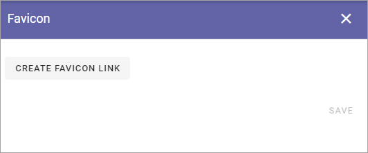
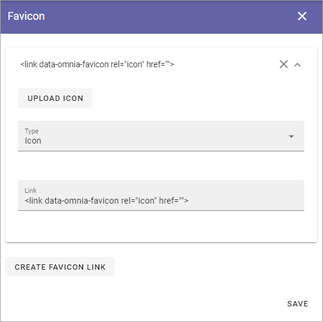

Favicon - Tenant settings
=======================================

Here you can set favicons for the whole tenant. It can be overwritten in the settings for a business profile. 

To add a Favicon, do the following:

1. Click CREATE FAVICON LINK.
2. Select the Omnia favicon (Icon) or The Apple Tocuch icon.

or:

1. Click UPLOAD ICON to uplade a favicon you have created.
2. Use the media picker to select and upload the icon.

3. Save when you're done.

For more information about the media picker, see: :doc:`The Media picker </general-assets/media-picker/index>`

For more information about favicons in general, see for example this page: https://css-tricks.com/favicon-quiz/
