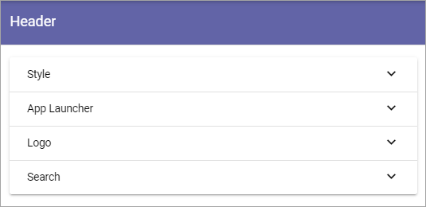
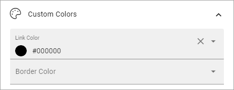
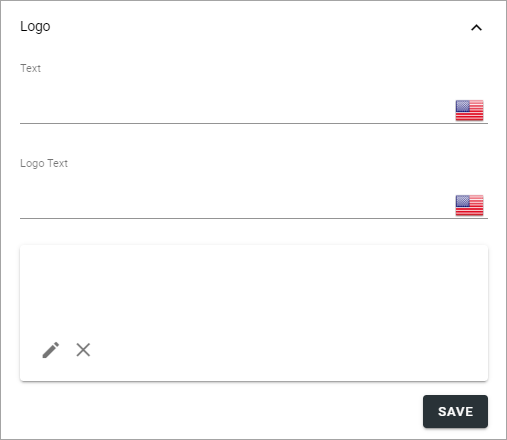

Header settings in Omnia 6.5
==============================

This is an ongoing, preliminary documentation for functionality to come in Omnia 6.5.

Here you can change the default settings for the Header in the tenant. In the header settings for a workplace for a Business Profile, you can then choose to inherit those settings or create specific settings. 

Style
*********
Set Background Color and Text Color here.

.. image:: tenant-header-settings-65.png

App Launcher
***************
You can create the feeling that when entering Omnia the user is still in Microsoft 365, by adding the Omnia App Launcher. The Omnia App Launcher is fully configurable. It's placed in the same position as the App Launcher in Microsoft 365. Here you can edit the settings. 

.. image:: omnia-app-launcher-65.png

+ **Enable**: The first step is to decide to use the Omnia App Launcher or not. If it's not enabled, the space is simply empty.

Note that there's a feature available for the tenant to install default App Launcher links to make it really easy to get going with the Omnia App Launcher. For more information, see: :doc:`Features - Tenant </admin-settings/tenant-settings/features/index>`

App Launcher Button
--------------------
Here you can set background color, icon color and hover color, if you're not happy with the default color settings.

General
---------
The following settings are available here:

.. image:: app-launcher-settings-general-65.png

+ **Title**: Set the title for the App Launcher in any or all available languages. This is shown as the Tool Tip for the button.
+ **Sorted By**: Open the list and decide how to sort the icons; Custom, Alphabetic or Last Visited. If you choose Custom, use the option "Custom" below for sorting.
+ **View Template**: The icons can be viewed in a number of ways; Simple List, App Icons, Navigation View or App launcher. See below for examples.
+ **Include Non-mandatory links**: Mandatory links are always displayed. Select this option if non-mandatory links, in the link categories selected, should be displayed as well.
+ **Use Targeting**: Targeting is set per link in the Shared Links sections, one available for the Tenant, and one available for the Business Profile. Here you can choose to use the links targeting setting or not. Default=not selected, meaning the targeting setting for the link is not used.  
+ **Include Personal Links**: If the logged in user's personal links, created using My Links, should be displayed in the App Launcher as well , select this option. Note that one or more categories that contain personal links will have to be selected below, for any personal links to show up.
+ **Include Following Links**: Users can follow links in My Links. If these links should be available in the App Launcher as well, select this option. Note that one or more categories that contain followed links will have to be selected below, for any followed links to show up.
+ **Hide Empty Result Text**: If the message that no links where found should not be shown, select this option.
+ **Categories**: Select one or more categories of links to display in the App Launcher. Each link is categorized when set up, either for the Tenant or for the Business Profile. 
+ **Item Limit**: Set the number of links that should be displayed in the list, before "All Apps" or similar is shown. 

Custom colors
---------------
Here you can set custom colors for the icons, if needed:

Custom Sort
-------------
(A description will be added soon.)

Logo
************
Set the following here:

+ **Text**: A text can be displayed beside the logo, see example below. Different texts can be added for all tenant languages, if needed.
+ **Logo text**: (A description will be added soon).
+ **Url**: Add the Url to the logo here.
+ **(Image field)**: Click the pen to add a logo image, using the Media Picker, the x to delete.

For information about how to use the Image Picker, see: :doc:`The Media Picker </general-assets/media-picker/index>`

Search
********
The following settings are available here:

.. image:: header-search-settings-65.png

+ **Search Box on Header**: If a search box should be available in the header, select this option.
+ **Default Search Box text to Query string (q) value**: Available when the option above is selected. For advanced search implementations. With this option active you can add parameters to the search query string, for various implementations.
