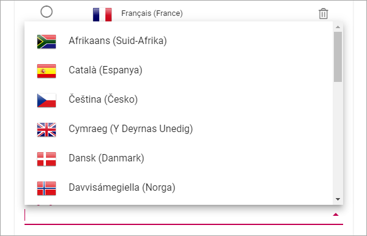
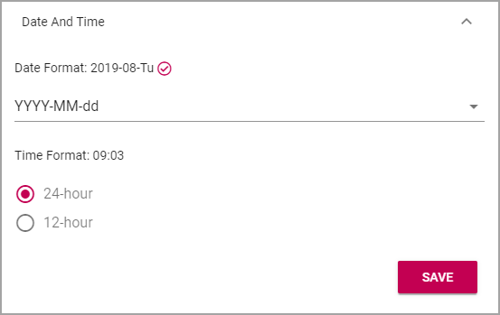
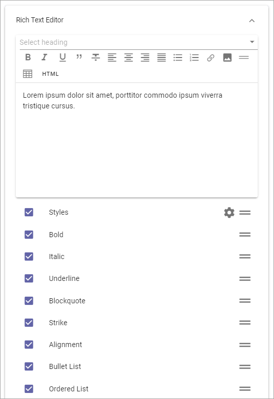
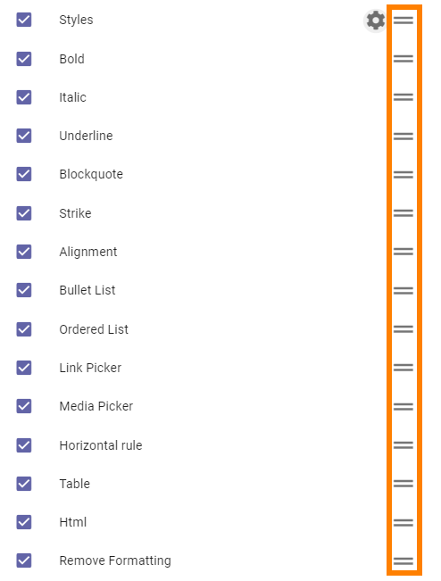
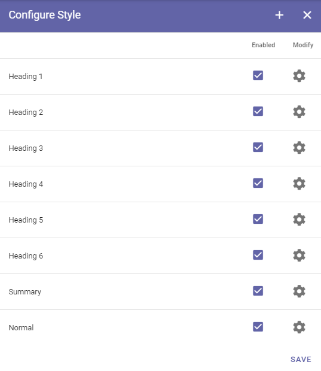
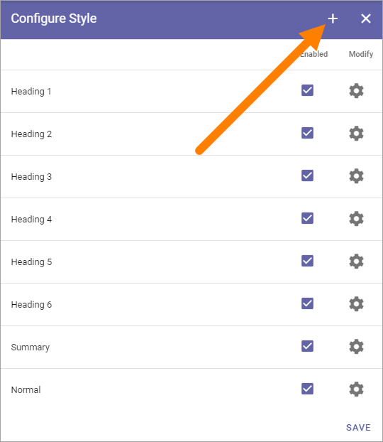

Settings
====================

Here you can set the following:

.. image:: tenant-settings-new2.png

General
********
Here you add settings for the start link. This is used when a user clicks the logo an can be used in the breadcrumb.

.. image:: tenant-settings-general.png

+ **Title**: Set the title for the link here.
+ **Home Url**: Set the default home Url (the globe). You can also set a Url for the link when it's clicked in Teams. 

Save when you're done.

Regional Settings
******************
Use these settings for languages, date and time, for the tenant. Other settings for this can be set for a Business Profile.

.. image:: regional-settings-new.png

Languages
-----------------
Use this setting to select the languages that should be available for the user interface in the tenant. These languages can also be used for Announcements and Shared Links. 

You can add and remove languages here any time.

Language versions of pages are handled differently. Page Variations are used for this purpose, see the heading "Variations" on this page:  :doc:`Page Settings </pages/page-settings/index>`

There must always be a language selected as Default Language, in this example English (United States):

.. image:: tenant-settings-language-default.png

To select another language as default, just click the ring and save. To remove a language from this list, click the dust bin.

Do the following to add a new language:

1. Click "Add Language".

.. image:: click-add-language.png

2. Open the list and select a language.

3. Click "Add".

.. image:: language-list-add.png

4. Continue and add all languages that should be available in the tenant.

**Note!** The list of languages is long, but that does not mean that the interface is available in all languages. You must make sure the interface has been translated to the languages you need.

5. Click "Save" when you're done.

Language displayed for a user
-------------------------------
What language a specific user will see for the interface, in Announcement messages and Shared links, depends on the user's Preferred Language setting in the Azure AD.

Date And Time
--------------
For Date And Time you can set the following:

Use the list to set the date format and select 24-hour or 12-hour Time Format.

Don't forget to save when you're done.

Header
********
Here you can change the default settings for the Header in the tenant. Additional settings, sometimes overriding the Tenant Settings, can be made for each Business Profile. 

.. image:: tenant-settings-header.png

General
---------
Set Background Color and Text Color here.

.. image:: tenant-header-settings-new.png

Logo
------
Set the following here:

.. image:: logo-settings-new.png

+ **Text**: A text can be displayed by the logo, see example below. Different texts can be added for all tenant languages, if needed.
+ **Url**: Add the Url to the logo here.
+ **ADD IMAGE**: Another way is to use this option to start the Media Picker and select a logo image.

To remove an image, click the X.

In this example the text "Adventrix Group" is displayed to the right of the logo:

.. image:: logo-text.png

RTF Editor
***********
Use these settings to decide which default options should be available for the Rich Text Editor and the Limited Rich Text Editor, in the tenant. 

.. image:: rtf-editor-new.png

**Note!** For some blocks a Custom RTF Editor can be created. If that is done it will override these settings.

Both lists are handled the same way.

1. Select and deselect options to be available in the editor and save when you're done.

(All options are not shown in the image above, there's a lot more.)

At the top you will see a preview of what the RTF editor will look like with the selected options.

Remove Formatting is not an option shown as an icon in the RTF editor. The option becomes available when it's needed - when formatted text is selected or when text with formattion is pasted.

Text Translator is the option for Machine Translations editors can use (Available at the bottom of the list, not activated in the image above). 

All other options should be fairly self explanatory.

Settings for Styles
--------------------
To edit the settings for Styles, click the cog wheel.

.. image:: tenant-settings-styles.png

Select the styles that should be available in the list.

.. image:: tenant-settings-styles-select.png

**Note!** You can use Text Styles to configure styles. The enabled styles from Text Styles are those shown in the above list. See below for more information on Text Styles.

Reorder the options
---------------------
If you would like to reorder the options in the editor, use these icons to drag and drop:

Text Styles
*************
Here you can edit the settings for the text styles used in the RTF editor, as well as create new styles.

In the column Enabled you decide which styles should be available to choose for the RTF editor. They are listed under Styles in the settings described above and are also available in a few blocks where a custom RTF editor can be created.

Click the cog wheel to edit the setting for a style. You can edit all settings available when creating a new style, see below.

Create a new text style
-------------------------
Do the following:

1. Click the plus.

2. Use these settings:

.. image:: text-styles-settings.png

+ **Title**: Add a title (name) for the style, in any or all available languages. Default tenant language is mandatory.
+ **Inherit**: To inherit style settings from the web browser (which can actually differ depending on the browser the user has), select this option. To set your own settings for the style, deselect the option and a settings field becomes available.

