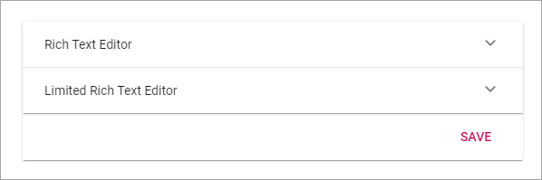
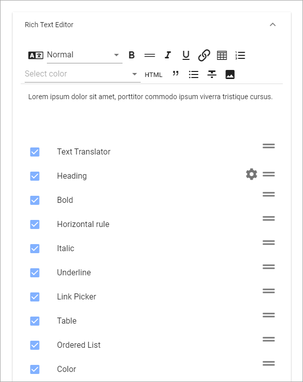
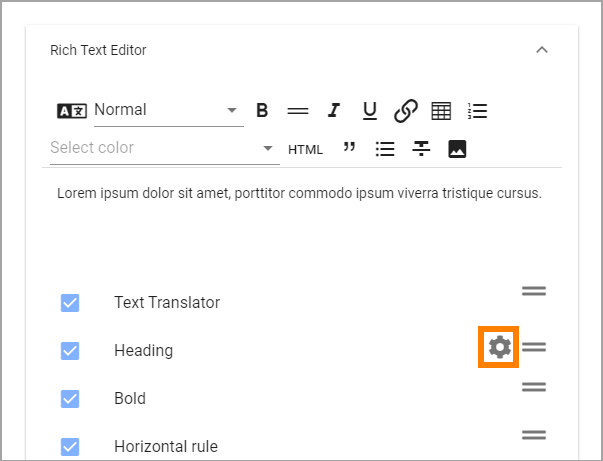
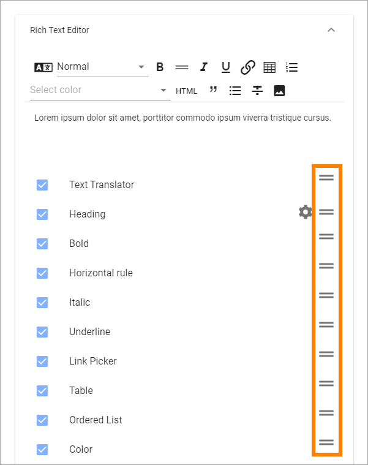

Settings
====================

Here you can set the following:

.. image:: tenant-settings.png

Regional Settings
******************
Use these settings for languages, date and time, for the tenant. Other settings for this can be set for a Business Profile.

Languages
-----------------
Use this setting to select the languages that should be available for the user interface in the tenant. These languages can also be used for Announcements and Shared Links. 

You can add and remove languages here any time.

Language versions of pages are handled differently. Page Variations are used for this purpose, see the heading "Variations" on this page:  :doc:`Page Settings </pages/page-settings/index>`

There must always be a language selcted as Dafeault Language, in this example English (United States):

.. image:: tenant-settings-language-default.png

To select another language as default, just click the ring and save. To remove language from this list, click the dust bin.

Do the following to add anew language:

1. Click "Add Language".

.. image:: click-add-language.png

2. Open the list and select a language.

.. image:: language-list-new.png

3. Click "Add".

.. image:: language-list-add.png

4. Continue and add all languages that should be available in the tenant.

**Note!** The list of languages is long, but that does not mean that the interface is available in all languages. You must make sure the interface has been translated to the languages you need.

5. Click "Save" when you're done.

Language displayed for a user
-------------------------------
What language a specific user will see for the interface, in Announcement messages and Shared links, depends on the user's Preferred Language setting in the Azure AD.

Date And Time
--------------
For Date And Time you can set the following:

.. image:: date-time.png

Use the list to set the date format and select 24-hour or 12-hour Time Format.

Don't forget to save when you're done.

Header
********
Here you can change the default settings for the the Header in the tenant. Additional settings, sometimes overriding the Tenant Settings, can be made for each Business Profile. 

General
---------
Set Background Color and Text Color here.

.. image:: tenant-header-settings.png

Logo
------
Set the following here:

.. image:: logo-settings-new.png

+ **Text**: A text can be displayed by the logo, see example below. Different texts can be added for all tenant languages, if needed.
+ **Url**: Add the Url to the logo here.
+ **ADD IMAGE**: Another way is to use this option to start the Media Picker and select a logo image.

To remove an image, click the X.

In this example the text "Adventrix Group" is displayed to the right of the logo:

.. image:: logo-text.png

RTF Editor
***********
Use these settings to decide which default options should be available for the Rich Text Editor and the Limited Rich Text Editor, in the tenant. 

**Note!** For some blocks a Custom RTF Editor can be created. If that is done it will override these setting.

Both lists are handled the same way even if there is a lot more to choose from for the Rich Text Editor.

1. Select and deselect options to be available in the editor.

(All options are not shown in the image above, there's a lot more.)

At the top you will see a preview of what the editor will look like with the selected options.

"Text Translator" is the option for a Machine Translation. All other options should be fairly self explanatory.

Additional settings
--------------------
For some options, settings can be available. In that case a cog wheel is shown:

To edit the settings, click the cog wheel.

For "Heading" you cab select which format options should be available:

.. image:: rtf-editor-cogwheel-heading.png

Reorder the options
---------------------
If you would like to reorder the options in the editor, use these icons to drag and drop:

