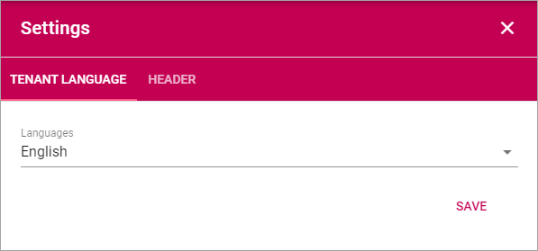
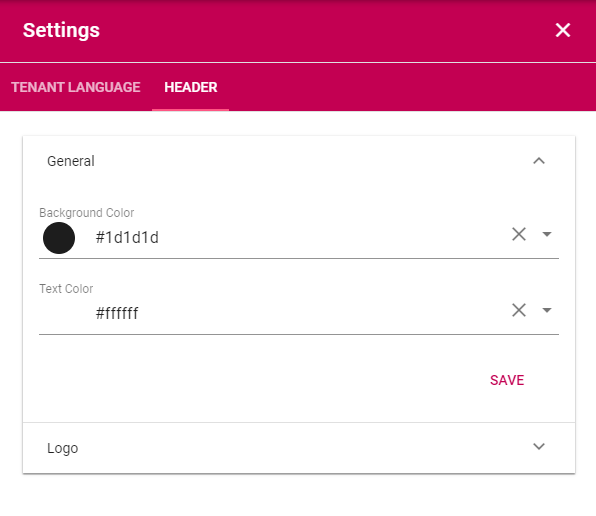

Settings
====================

Here you can set the following:

Tenant Language
*****************
Use the list to set available languages for the tenant. 

Header
********
Here you can change the default settings for Headings. The settings can be changed for a Block or Section when needed, in the settings for the Block/Section.

General
---------
Set Background Color and Text Color here.

Logo
------
Set the following here:

.. image:: logo-settings.png

+ **Text**: A text can be displayed by the logo, see example below.
+ **Url**: Add the Url to the logo here.
+ **ADD IMAGE**: Another way is to use this option to start the Media Picker and select a logo image.
+ **Padding**: You can add some padding around the logo if needed.

In this example the text "Adventrix Group" is displayed to the right of the logo:

.. image:: logo-text.png

