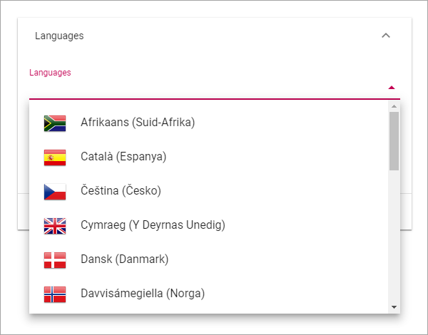

Settings
====================

Here you can set the following:

Regional Settings
******************
Use these settings for languages, date and time, for the tenant. Other settings can be set for a Business Profile.

Languages
-----------------
Use this setting to select the languages that should be available for the user interface in the tenant. Note that this setting is for the user interface only. Language versions of pages are handled differently - Page Variations (under development). 

Do the following to select languages:

1. Click "Add Language".
2. Open the list and select a language.

3. Click "Add"
4. Continue and add all languages that should be available in the tenant.

You can add additional languages anytime.

**Note!** The list of languages is long, but that does not mean that the interface is available in all languages. You must make sure the interface has been translated to the languages you need.

To remove a language from the tenant, just click the dust bin.

.. image:: language-remove.png

5. Click "Save" when you're done.

A users language
-----------------
What language a specific user will see for the interface depends on the user's Preferred Language setting in the Azure AD.

Date And Time
--------------
For Date And Time you can set the following:

.. image:: date-time.png

Use the list to set the date format and select 24-hour or 12-hour Time Format.

Don't forget to save when you're done.

Header
********
Here you can change the default settings for the the Header in the tenant. Additional settings, sometimes overriding the Tenant Settings, can be made for each Business Profile. 

General
---------
Set Background Color and Text Color here.

.. image:: tenant-header-settings.png

Logo
------
Set the following here:

.. image:: logo-settings.png

+ **Text**: A text can be displayed by the logo, see example below.
+ **Url**: Add the Url to the logo here.
+ **ADD IMAGE**: Another way is to use this option to start the Media Picker and select a logo image.
+ **Padding**: You can add some padding around the logo if needed.

In this example the text "Adventrix Group" is displayed to the right of the logo:

.. image:: logo-text.png

