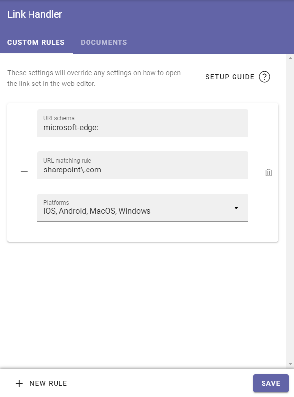
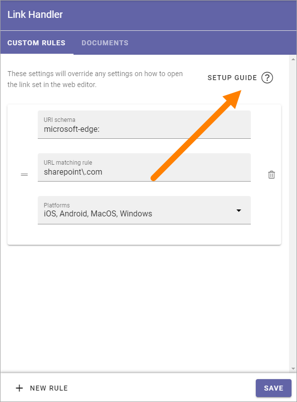
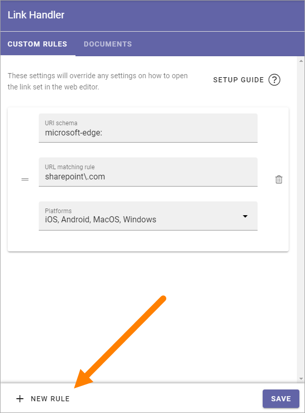

Link Handler
===============================

Prerequisite: the features Documents Link Handler and Rules Link Handler must be activated.

The following settings are available here:

You use the CUSTOM RULES to set up general rules for how links should be handled. A description of how to use the fields are found by clicking SETUP GUIDE.

To set up additional rules, click here:

Documents
************
The following field is available on this tab:

.. image:: link-handler-tenant-documents.png

Here you set up rules for documents especially. This is separate from the settings in the CUSTOM RULES tab. 

