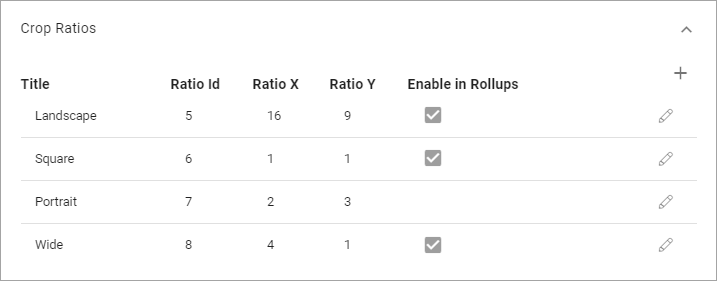

Media Picker Settings
======================

These settings are available in Omnia v6.

**(This documentation is just started, more will be added soon).**

.. image:: media-picker-settings.png

Scaling
********
Here you can set the following:

.. image:: media-picker-settings-scaling.png

+ **File Size Limit**: Set the limit, in bytes, for what is considered to be "too large" for an image in your system. When the file size of an image, selected in the Media Picker, exceeds this limit, a warning is shown. See below for an example.
+ **Title**: Displays title for the scalings that are set up.
+ **Scaling Id**: Displays the scaling id for the scalings that are set up.

The scaling settings listed can be used by authors and editors when an image is added using the Image Picker.

To edit a scaling setting, click the pen. See *Create a new scaling setting* below for available settings.

To remove a scaling setting, click the dust bin.

The warning when an image exceeds the file size limit can look like this.

(image to be added)

The author or editor can then decide to make the image web safe or add it as it is.

Create a new scaling setting
-----------------------------
To create a new scaling setting, do the following:

1. Click the plus.

.. image:: scaling-click-plus.png

2. Use the following settings:

.. image:: scaling-settings.png

+ **Unique ID**: This is set by the system and displayed here as information.
+ **Title**: Add a title for the scaling here. You can add titles in any tenant language.
+ **Max Dimension**: Set the maxumim size in pixels here.
+ **Format Settings**: You can choose to keep the original format or convert to Jpeg.
+ **Quality**: Use the slider to set the quality level for the scaling.

Don't forget to save when you're done.

Crop Ratios
****************
Set the crop ratios that should be available in Media Picker.

The following settings are available when you edit a crop ratio or when you create a new one:

.. image:: crop-ratios-settings.png

