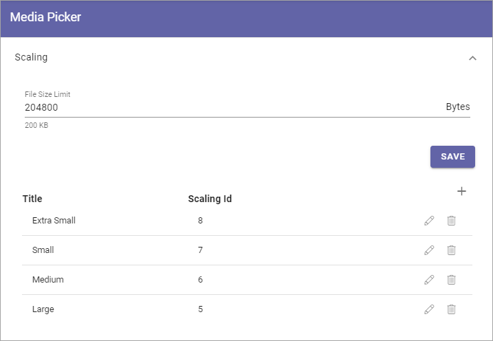
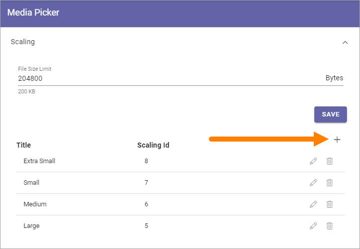

Media picker settings
======================

The following settings are available:

.. image:: media-picker-settings.png

Scaling
********
Here you can set the following:

+ **File Size Limit**: Set the limit, in bytes, for what is considered to be "too large" for an image in your system. When the file size of an image, selected in the Media Picker, exceeds this limit, a warning is shown. See below for an example.

The scaling settings listed can be used by authors and editors when an image is added using the Image Picker.

To edit a scaling setting, click the pen. See *Create a new scaling setting* below for available settings.

To remove a scaling setting, click the dust bin.

The warning when an image exceeds the file size limit can look like this:

.. image:: image-message.png

The author or editor can then decide to make the image smaller in size or add it as it is.

Create a new scaling setting
-----------------------------
To create a new scaling setting, do the following:

1. Click the plus.

2. Use the following settings:

.. image:: scaling-settings-new.png

+ **Title**: Add a title for the scaling here. You can add titles in any tenant language (click the flag to change language).
+ **Max Dimension**: Set the maxumim size in pixels here.
+ **Format Settings**: You can choose to keep the original file format or convert to Jpeg.
+ **Quality**: Use the slider to set the quality level for the scaling.

Don't forget to save when you're done.

Crop Ratios
****************
Set the crop ratios that should be available in Media Picker.

.. image:: crop-ratios-new.png

Click the pen to edit a crop ratio, or the dust bin to delete it.

The default ratios (Landscape, Square, Portrait, Wide) can not be deleted. They can be editd, but ratios can not be changed. For available settings that can be edited, see below.

Create a new Crop Ratio
-------------------------
To create a new crop ratio, do the following:

1. Click the plus.

.. image:: crop-ratios-click.png

2. Use the following settings:

.. image:: crop-ratios-settings-new.png

+ **Title**: Add a title for the crop ratio here. You can add titles in any tenant language (click the flag to change language).
+ **Ratio X**: Set the horizontal ratio here.
+ **Ratio Y**: Set the vertical ratio here.
+ **Enable in rollups**: Select this option if this ratio should be available to use in block rollups.

