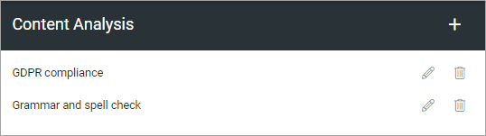
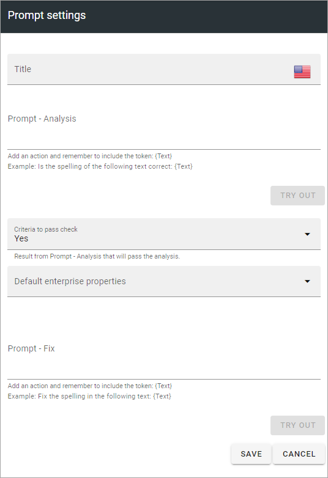

Content Analysis (OpenAI)
=============================================

This option is available in Omnia 7.1 and later.

You can set up a number of sets for content analysis. Here's an example:

Click the pen to edit, the dust bin to delete.

All settings are available for edit, see below.

Create a new analysis
************************
When creating a new analysis, the folliwing settings are available:

+ **Title**: Add a title for this setting, in any available tenant language (click the flag to change language).
+ **Prompt**: Add the text for the prompt here.
+ **Criteria to pass check**: Can be Yes or No.
+ **Default enterprise properties**: Select one or more properties here.
+ **Prompt fix**: You can add a prompt to ask OpenAI to fix something in the content, for example to fix the spelling.
+ **TRY OUT** You van try out the settings by clicking this button.

