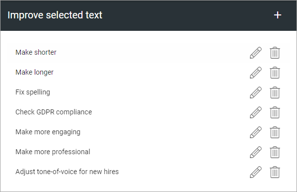
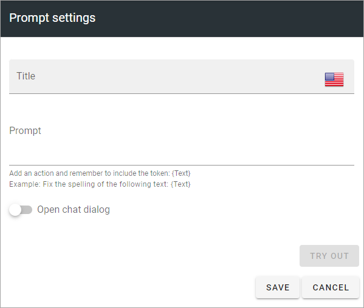
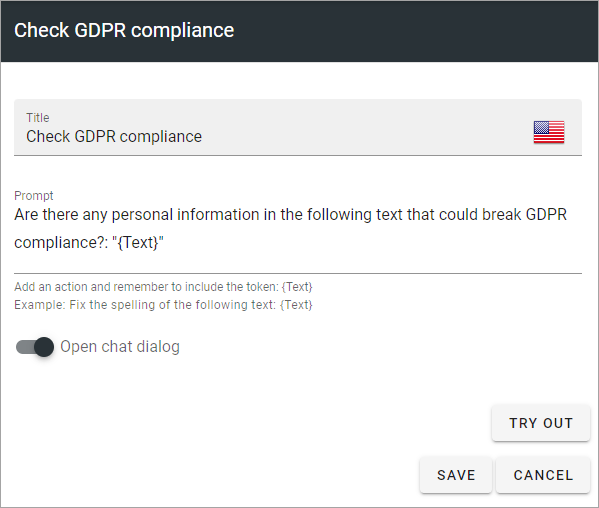

Improve selected text (OpenAI)
=============================================

This option is available in Omnia 7.1 and later. (Images from Omnia 7.5).

You can create a number of prompt settings here to be used by editors, with OpenAI, for example:

Click the pen to edit, the dust bin to delete.

All settings are available for edit, see below.

Create a new prompt setting
******************************
The following are available for a new prompt setting:

+ **Title**: Add a title for this setting, in any available tenant language (click the flag to change language). Mandatory.
+ **Prompt**: Add the text (the instruction to OpenAI) for the prompt here. Note the message under the field. The token {Text} must be added here, within quotation marks. See below for an example.
+ **Open chat dialog**: If the chat dialog should open, select this option. This can be useful for editors, as they can continue communicating with OpenAI to make addtional changes.
+ **TRY OUT**: You can try out the settings by clicking this button.

Here's an example of a prompt:

See the bottom of this page for information about how OpenAI can be used in the RTF editor: :doc:`Editing text with the RTF Editor </general-assets/rtf-editor/index>`

