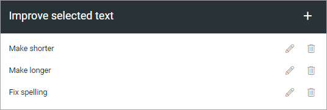
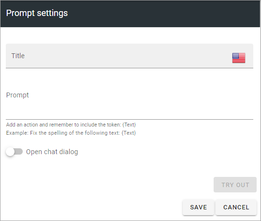

Improve Selected Text (Open AI)
=============================================

This option is available in Omnia 7.1 and later.

You can create a number of prompt settings here to be used with Open AI, for example:

Click the pen to edit, the dust bin to delete.

All settings are available for edit, see below.

Create a new prompt setting
******************************
The following are available for a new prompt setting:

+ **Title**: Add a title for this setting, in any available tenant language (click the flag to change language).
+ **Prompt**: Add the text for the prompt here.
+ **Open chat dialog**: If the chat dialog should open, select this option.
+ **TRY OUT** You van try out the settings by clicking this button.

