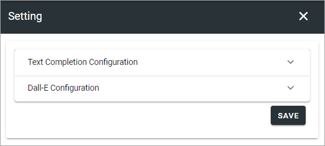
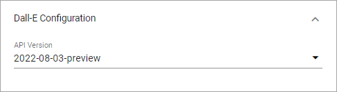

Settings (Open AI)
=============================================

This option is available in Omnia 7.1 and later. 

The following settings are available here:

Text Completion Configuration
*******************************
The folling are availble here:

.. image:: settings-open-ai-completion.png

+ **AI Alias**: 
+ **Deployment Name**: 
+ **API Version**: 

Dall-E Configuration
*********************
Here you can set the API Version for Dall-E.

Don't forget to save your changes.

