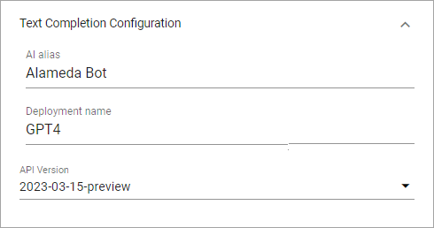

Settings (OpenAI)
=============================================

This option is available in Omnia 7.1 and later. (Options are a bit different in Omnia 7.5, see below).

The following settings are available here:

.. image:: settings-open-ai.png

Text completion configuration
*******************************
The following options are availble here:

+ **AI alias**: Add the label to be used in the UI here.
+ **Deployment name**: Add the name for the deployment you are using. 
+ **API version**: Select tha appropriate API version here. (In Omnia 7.5, this option is not available, it's now set automatically).

Dall-E configuration
*********************
Here you can set the API version for Dall-E. (In Omnia 7.5, this option is not available, it's now set automatically).

.. image:: settings-open-ai-dalle.png

Don't forget to save your changes.

