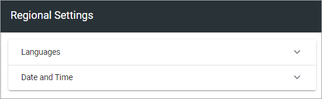
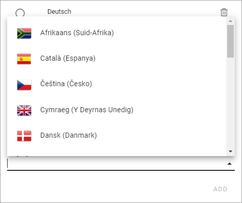
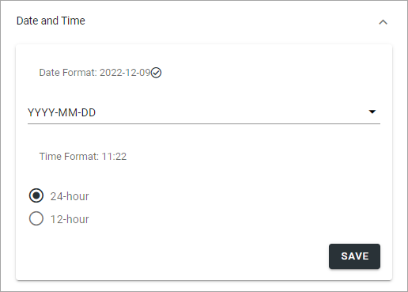

Regional settings
==========================

Use these settings for languages, date and time, for the tenant. Other settings for this can be set for a Business Profile.

Languages
*************
Use this setting to select the languages that should be available for the user interface in the tenant. These languages can also be used for Announcements and Shared Links. 

You can add and remove languages here any time.

Language versions of pages are handled differently. Page Variations are used for this purpose, see the heading "Variations" on this page:  :doc:`Publishing App Settings </pages/page-settings/index>`

There must always be a language selected as Default Language, in this example English (United States):

.. image:: tenant-settings-language-default-612.png

+ **Exclude Country**: If you don't want to show a country flag for the language in the lists where users select language, select this option. (When you do the flags dissapears from this list as well).

To select another language as default, just click the ring and save. To remove a language from this list, click the dust bin.

Do the following to add a new language:

1. Click "Add Language".

.. image:: click-add-language-612.png

2. Open the list and select a language.

3. Click "Add".

.. image:: language-list-add-612.png

4. Continue and add all languages that should be available in the tenant.

**Note!** The list of languages is long, but that does not mean that the interface is available in all languages. You must make sure the interface has been translated to the languages you need.

5. Click "Save" when you're done.

Language displayed for a user
-------------------------------
What language a specific user will see for the interface, in Announcement messages and Shared links, depends on the user's Preferred Language setting in the Azure AD.

Date And Time
****************
For Date And Time you can set the following:

Use the list to set the date format and select 24-hour or 12-hour Time Format.

Don't forget to save when you're done.
