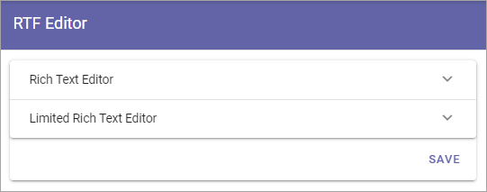
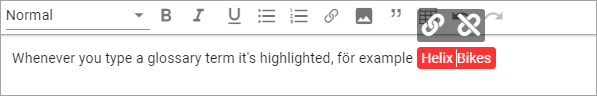
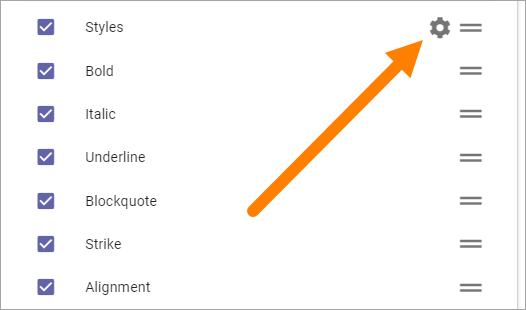
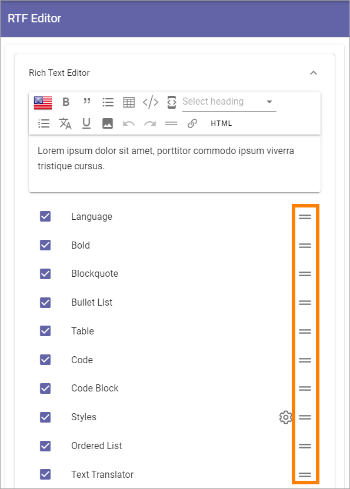

RTF Editor settings
====================

Use these settings to decide which default options should be available for the Rich Text Editor and the Limited Rich Text Editor, in the tenant. 

**Note!** For some blocks a Custom RTF Editor can be created. If that is done it will override these settings.

Both lists are handled the same way.

1. Select and deselect options to be available in the editor and save when you're done.

.. image:: rtf-editor-options-new2.png

(All options are not shown in the image above, there's a lot more.)

At the top you will see a preview of what the RTF editor will look like with the selected options.

Most options should be self explanatory, but some options may need a description, see below.

Activate machine translation
-------------------------------
Text Translator is the option for Machine Translations editors can use. **Note!** Machine translation is not available in Omnia on-prem.

Make the RTF editor Enterprise Glossary aware
------------------------------------------------
You can select "Enterprise Glossary Suggestion" to make the RTF Editor Enterprise Glossary aware.

This means that whenever an author writes something in an RTF editor that match a term in the Enterprise Glossary, it will be highlighted. The author can click on the highlighted text and decide whether to create a link or not to the Enterprise Glossary term. If a link to the term is created, it will be possible for the end user to click on it and get detailed information about the term.

When a term is highlighted, it can look like this:

.. image:: rtf-editor-glossary-aware-highlight.png

When the author clicks the highlighted term, these two icons are shown:

The icon to the left is used to create a link, the other one to remove the link.

Animated GIF and emojis
-----------------------------
The possibility to add an animated GIF and/or to add emojis, can be available in the RTF Editor. You can choose this by selecting "Gif" and/or "Emoji Picker".

See the headings "Add an animated GIF" and "Add an emoji" on this page for information about how it works: :doc:`Editing text with the RTF Editor </general-assets/rtf-editor/index>`

Settings for Styles
--------------------
To edit the settings for Styles, click the cog wheel.

Select the styles that should be available in the list.

.. image:: tenant-settings-styles-select.png

**Note!** You can use Text Styles (option in the Settings menu) to configure styles. The enabled styles from Text Styles are those shown in the above list. 

OpenAI
---------
OpenAI can be made available here (in Omnia 7.1 and later), according to Omnia Admin settings. See this page for more information: :doc:`OpenAI (Admin settings) </admin-settings/tenant-settings/settings/open-ai/index>`

Reorder the options
---------------------
If you would like to reorder the options in the editor, use these icons to drag and drop:

