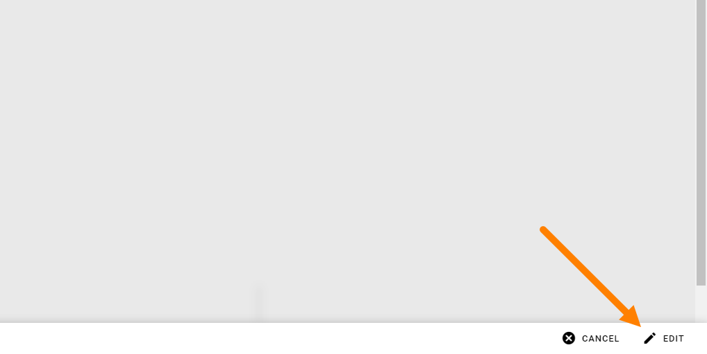

System Layouts
=============================================

**This page is under construction.**

This option is available in Omnia 7.1 and later.

Here you can create pages for the 401 and 404 messages:

.. image:: system-layouts-list.png

To create any of the layouts, select the page and click EDIT.

Create the layout for the page the same way as other layouts in Omnia, see: :doc:`Working with layouts </general-assets/working-with-layouts/index>`

