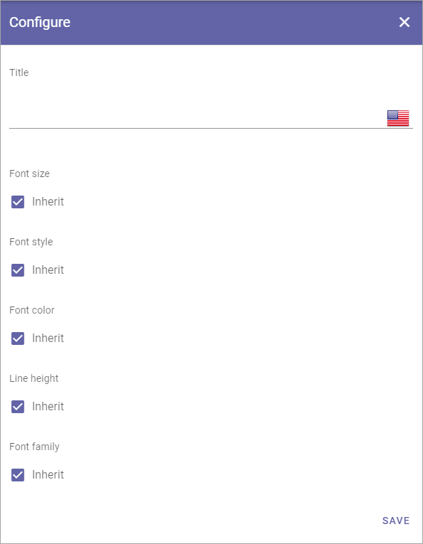

Text styles
=============

Here you can edit the settings for the text styles used in the RTF editor, as well as create new styles.

.. image:: tenant-settings-text-styles-new.png

In the column Enabled you decide which styles should be available to choose for the RTF editor. They are listed under Styles in the settings for the RTF Editor and are also available in a few blocks where a custom RTF editor can be created.

Click the cog wheel to edit the setting for a style. You can edit all settings available when creating a new style, see below.

Create a new text style
-------------------------
Do the following:

1. Click the plus.

.. image:: text-styles-click-plus-new.png

2. Use these settings:

+ **Title**: Add a title (name) for the style, in any or all available languages (click the flag to change language).
+ **Inherit**: To inherit style settings from the web browser (which can actually differ depending on the browser the user has), select this option. To set your own settings for the style, deselect the option and a settings field becomes available.

Here's an example with settings open for Font size and Font color:

.. image:: text-styles-settings-edit.png

Additional settings for Link Styles
------------------------------------
For Link Styles you can also define settings for ON HOVER:

.. image:: text-styles-on-hover-new.png

Font Style - Inherit means the same Font Style that is set on the Default tab.

