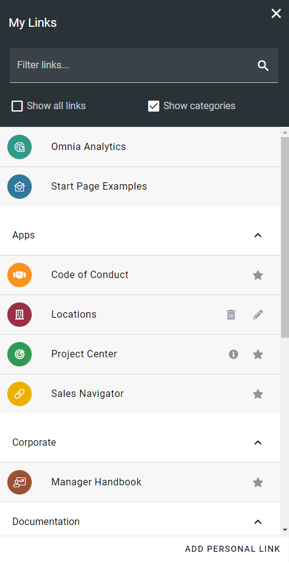
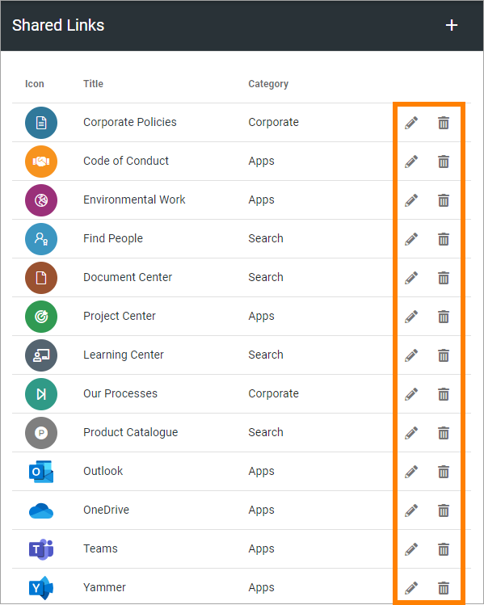
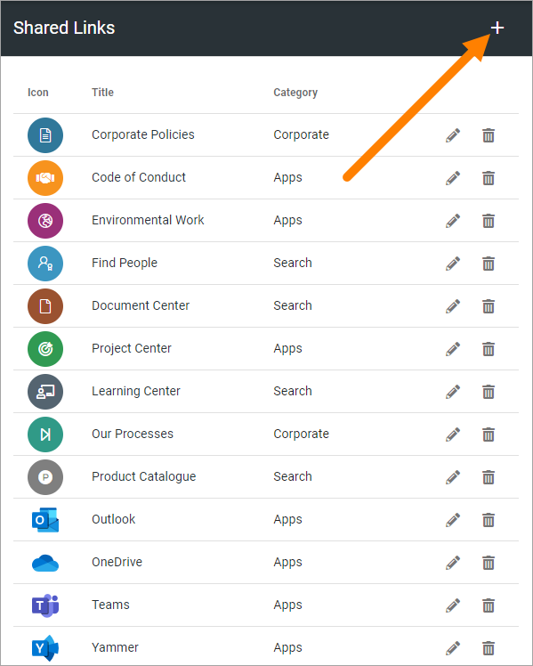
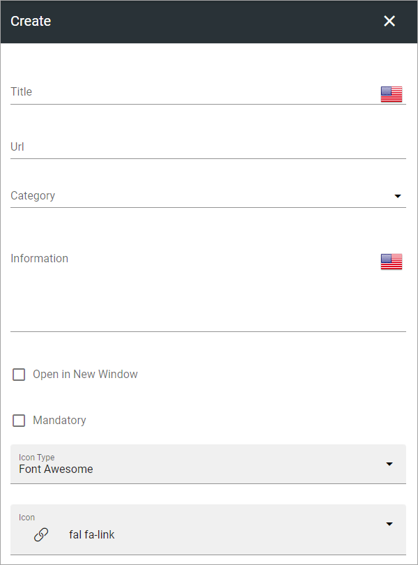

Shared links
=======================

Using Shared links a Tenant Administrator, (or any other user added in the Permissions list, see below) can create links that users can access through "My Links". It makes it possible to create a central list of links, in Omnia Admin, to resources that are commonly used within the organization. 

Some links can be mandatory and it's also possible to target links to certain groups. 

These links can also be accessed through a Quick Links block on any page, see: :doc:`The Quick Links block </blocks/quick-links/index>`

There can be Shared Links specifically for a Business Profile. Such links are created and edited through the Shared Links option under the Business Profile. Options for Tenant Shared Links and Business Profile Shared Links are identical. Shared Links for a Business Profile can coexist with Shared Links for the Tenant.

**Note!** Do not delete or alter the links to Microsoft 365 applications, if present. They are needed for the App Launcher menu in Omnia.

The end user experience
*************************
The end user can access the Shared Links in the My Links control. The list contains all active links. The user can decide which non-mandatory links to display and can add personal links there. Here's an example:

For more information about how to use My Links, see: :doc:`My Links</user-options/my-links/index>`

Settings
**********
In the list of Shared Links, click the pen to edit a link or the dust bin to delete a link.

When editing a link, all options available when creating a new link can be edited, see below.

Create a Shared Link
---------------------
Do the following:

1. Click the plus.

2. Set the following:

(Not all options are shown in the image.)

+ **Title**: The title is shown as the clickable text for the link. If you use more than one language in the tenant you can add a title in each language. Note that you must always add a title in the default langauge, other languages are optional. Click the flag to change language.
+ **URL**: The URL to go to when the user clicks the link.
+ **Category**: Links that are the same category will automatically be sorted together when the user chooses to display the categories. (in the My Links example above, the links are sorted by Category).
+ **Information**: This field can be used for additional information about the link. If you enter something here, an information icon is shown next to the link. Users can click the icon to read the information. Not mandatory. If you use more than on language in the tenant you can add the information in each language. Click the flag to change language.
+ **Open in New Window**: Select to open the url in a new browser window. Normally a good idea for external links.
+ **Mandatory**: If selected, the link is always shown for all users (or the limited set of users, if targeted), and can not be deselected.
+ **Icon Type**: An icon is always shown for a link. If you would like another icon for this link, select the set of Icons here: "Font Awesome", "Microsoft" or "Custom". When selecting "Custom" you can choose any image as the Icon, using the Media Picker. For more information, see: :doc:`Media Picker </general-assets/media-picker/index>`
+ **Icon**: When you have select Icon Type, use this list to select the icon. If you selected "Custom", an ADD ICON button is shown instead. Note the icon preview under the color settings.
+ **Icon Color**: You can set a Custom Color for the icon, if you wish. You can't select color for a Custom icon.
+ **Icon Background Color**: Set the background color for the icon here. If note set, default icon background color is used.
+ **Targeting Filter**: Use these settings for targeting, for the link. See below for instructions.

All languages to be used here must be setup in the Tenant Settings, see: :doc:`Regional Settings </admin-settings/tenant-settings/settings/regional-settings/index>`

Targeting a Shared Link
------------------------
Targeting a link works the same way as in many other parts of Omnia. See this page for more information: :doc:`Using Targeting </general-assets/targeting-in-omnia/index>`

Permissions for Shared Links
*****************************
Shared Links has a seperate Permissions setting, so any user can be set as a Shared Links administrator. This includes external users that has been invited in the Azure AD, meaning they can log in with their own Microsoft 365 account. 

For more information about permissions, see: :doc:`Permissions for the Tenant </admin-settings/tenant-settings/permissions/index>`

Note that Tenant Administrators always can work with Shared Links.

