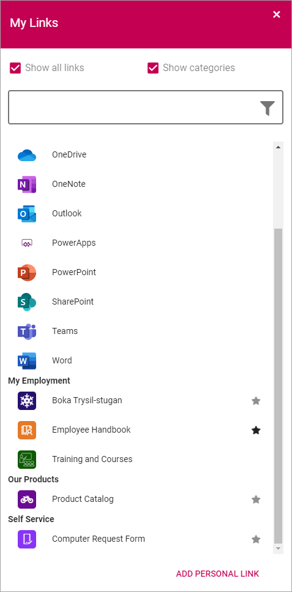
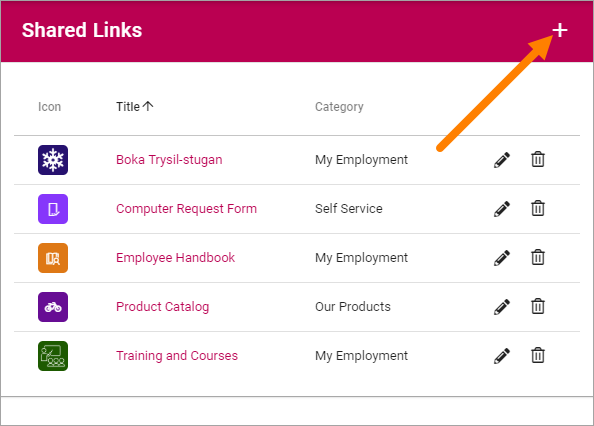
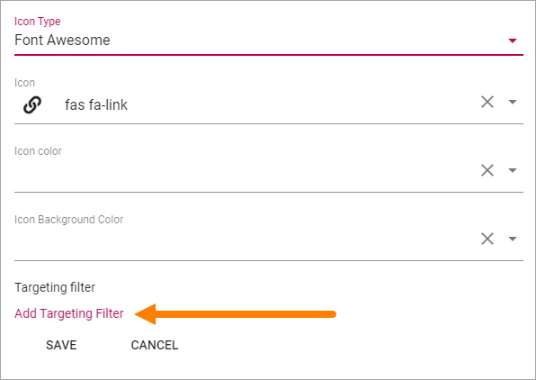
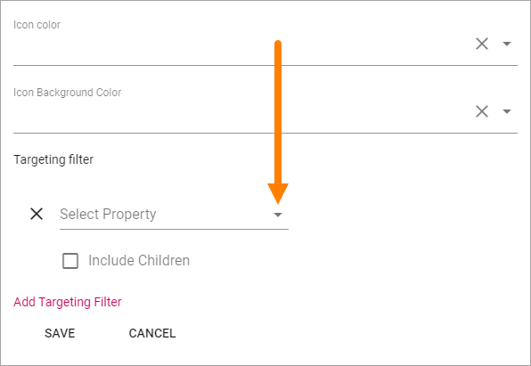
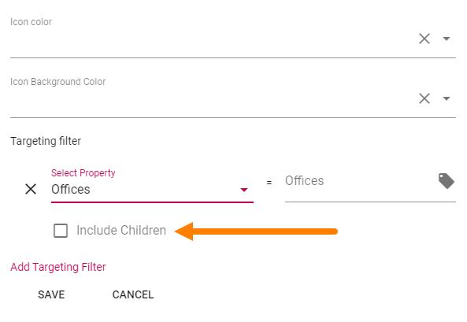

Shared Links
=======================

Using Shared Links a Tenant Administrator can create links that user can access through "My Links". It makes it possible to create a central list of links, in Omnia Admin, to resources that are commonly used within the organization. 

Some links can be mandatory and it's also possible to target links to certain groups. 

The end user can access the Shared Links in the My Links control. The list contains all active links. The user can decide which non-mandatory links to display and can add personal links there. Here's an example:

These links can also be accessed through a Quick Links block on any page, see: :doc:`The Quick Links block </blocks/quick-links/index>`

There can be Shared Links specifically for a Business Profile. Such links are created and edited through the Shared Links option under the Business Profile. Options for Tenant Shared Links and Business Profile Shared Links are identical. Shared Links for a Business Profile can coexist with Shared Links for the Tenant.

**Note!** Do not delete or alter the links to Office 365 applications, if present. They are needed for App Launcher menu in Omnia.

Create a Shared Link
**********************
Do the following:

1. Click the plus.

2. Set the following:

.. image:: shared-links-settings.png

+ **Title**: The title is shown as the clickable text for the link.
+ **Url**: The url to go to when the user clicks the link.
+ **Category**: Links that are the same category will automatically be sorted together when the user chooses to display the categories. (in the My Links example above, the links are sorted by Category).
+ **Information**: This field can be used for additional information about the link. If you enter something here, an information icon is shown next to the link. Users can click the icon to read the information. Not mandatory.
+ **Open in New Window**: Select to open the url in a new browser window. Normally a good idea for external links.
+ **Mandatory**: If selected, the link is always shown for all users (or the limited set of users, if targeted), and can not be deselected.
+ **Icon Type**: An icon is always shown for a link. If you would like another icon for this link, select the set of Icons here: "Font Awesome", "Fabric" or "Custom". When selecting "Custom" you can choose any image as the Icon.
+ **Icon**: When you have select Icon Type, use this list to select the icon. If you select "Custom", this list is not shown. Instead a "Url" field is shown, where you enter the Url for the image.
+ **Icon Color**: You can set a Custom Color for the icon, if you wish. 
+ **Icon Background Color**: Set the background color for the icon here. If note set, default icon background color is used.
+ **Targeting Filter**: Use these settings for targeting, for the link. See below for instructions.

Targeting a Shared Link
*************************
To target a link, do the following. Note that Properties for targeting must be set up first, see: :doc:`Targeting Properties </admin-settings/tenant-settings/targeting-properties/index>`

1. Click "Add Targeting Filter".

2. Open the list and select property.

 
3. Select one or more children properties, if applicable.

.. image:: select-children-properties.png
 
Or:
3. Select to include all children properties.

  
To delete a targeting filter, just click the x.

.. image:: delete-targeting-filter.png

Edit or delete a Shared Link
*****************************
In the list of Shared Links, click the pen to edit a link or the dust bin to delete a link.

.. image:: shared-links-edit.png

When editing a link, all options available when creating a new link can be edited, see above.

