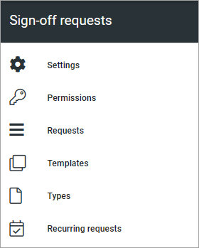

Sign-off requests
====================================

Sign-off requests can be used for read receipts for pages, including news. One example of implementation is pages a new employee should study. In Omnia 7.7 and later, sign-off requests can be used for controlled documents as well.

The following settings are available here:

Select section for more information:

.. toctree::
   :titlesonly:

   sign-off-settings-613/index
   sign-off-permissions-613/index
   sign-off-request-requests-613/index
   sign-off-templates-613/index   
   sign-off-types-613/index
   recurring-requests/index

A rollup block for sign-off requests, so managers and aministrators can keep track, is also be available: :doc:`Sign-off requests block </blocks/sign-off-requests-rollup-613/index>`

