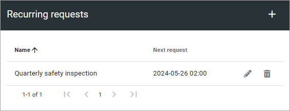
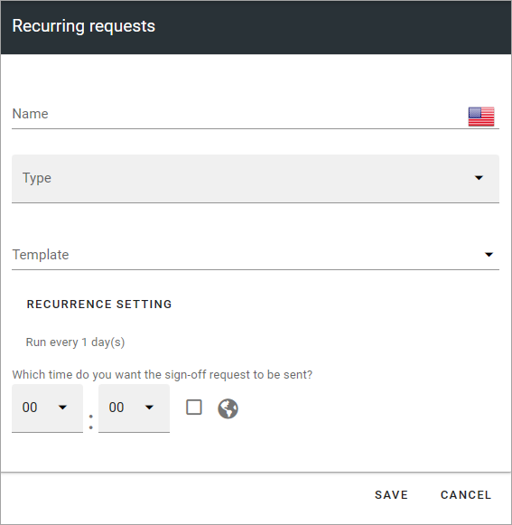
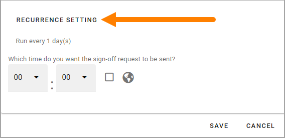
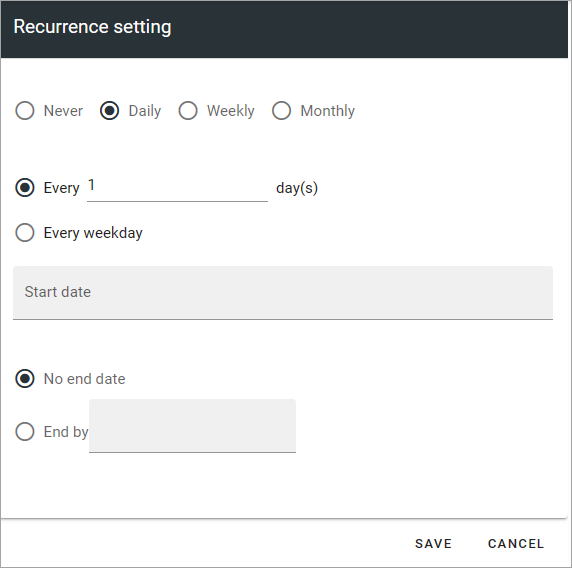
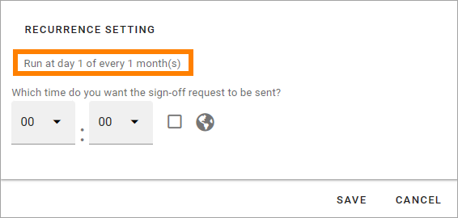
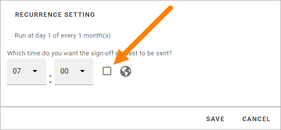

Recurring requests
========================

This is a new option in Omnia 7.6. 

Use this option to set up sign-off requests that occurs with regular intervals, with an end date, or just rolling until you change it.

If any recurring requests has been set up, they are shown in the list. All settings, as described below, can be edited. Click the pen. A recurring request you no longer need can be deleted (the dust bin). But remember, you can easily edit a request for another use.

The following settings are available for a new, recurring request:

+ **Name**: Add a name for the list of recurring requests. Not shown for users.
+ **Type**: Select a type of request. Types are set up using the "Type" option for requests.
+ **Template**: A type can be connected to one or more templates, if more than one template is available, you can select template here.
+ **Title**. This is the title users will see.
+ **Description**: Users will see the description. The field can contain a suggested text or information to the administrator, from the template. Change the text to fit the recurring request.

"To be signed off", "Properties", "Sign-off type" and "Requested by" works exactly the same as when a normal request (= not recurring) is created, see the heading "Create a new request" on this page: :doc:`Requests </admin-settings/tenant-settings/sign-off-requests-613/sign-off-request-requests-613/index>` 

Recurrence settings
--------------------------
To set details for the recurrence, do the following:

1. Click RECURRENCE SETTINGS to access this part of the settings.

2. Use these settings:

Weekday is Monday to Friday, as opposed to "Every X day(s)". All other options should be self explanatory. 

Note that if you should select a day that is not a weekday as the first send out, the first weekday is still used automatically.

3. Save the settings.

When the recurrence settings has been done, you can now see that the information about recurrence has been changed according to your settings. 

4. You can set time for when the sing-off should be sent. 

If you want to set the time zone to calculate the time on, click the box. Default time is UTC, meaning that is what will be used if you don't select time zone. Also note the information that is shown for when the send will occur calculated on the time zone where you are.

5. Save the changes for the recurring request.

