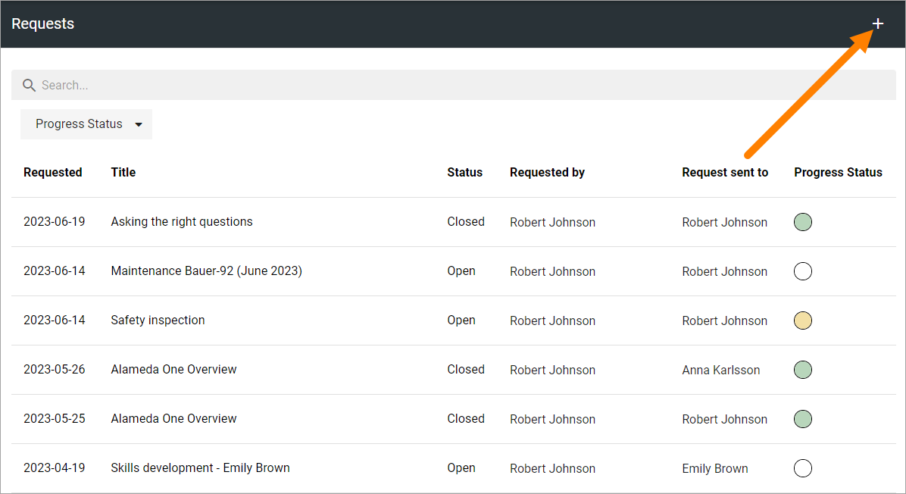
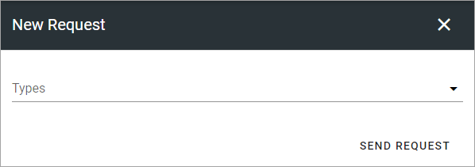
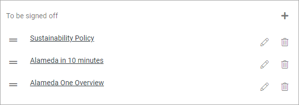
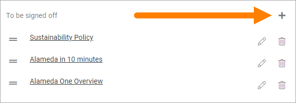
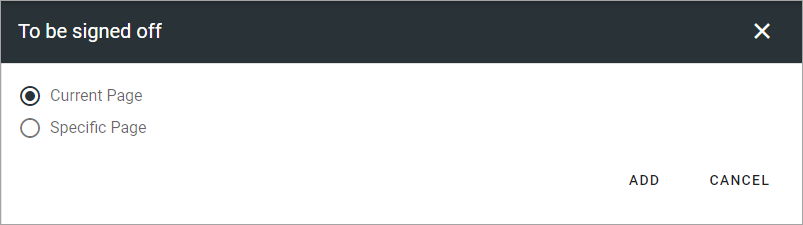
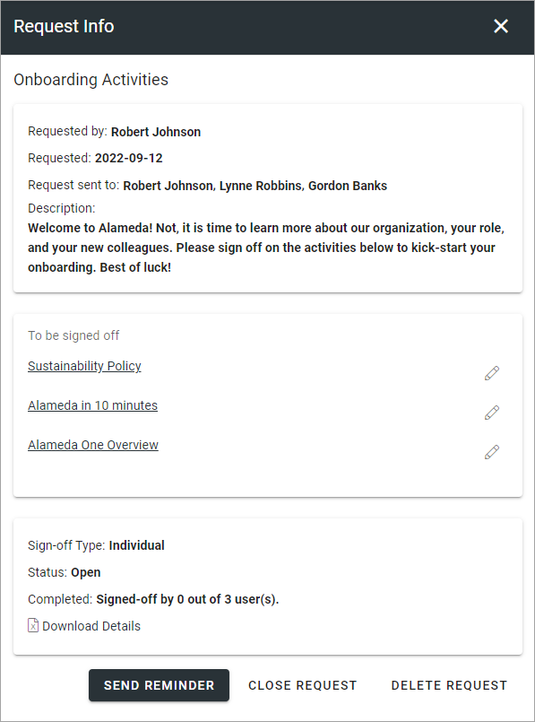

Requests
=============================================

All created requests are listed here. You can filter on "Requested by" and "Progress status" (Not started, In progress or Completed).

Here's an example of a list:

.. image:: sign-off-requests-requests-v76.png

The "Status" column indicates if the request is open or closed. the "Progress status" column to the right indicates the number of answers; white for none, yellow for some/ongoing and green for all that the request was sent to.

You can search for a request and you can filter the list using the list where it says "Progress status".

For more details and the possibiblty to delete a request, click the link (title).

Create a new request
***********************
To create a new request, do the following:

1. Click the plus.

2. The following is now shown:

+ **Types**: Only available if more than one type has been set up, and is then mandatory. If just one type exists, it's still used (the properties are available) but the "Types" option is not shown here. 

When you have selected type, some or all of these settings can be available: 

+ **Name**: Add a name for the request here, in any of the tenant languages.
+ **Description**: You can add a description of the request, in any of the tenant languages.
+ **Properties**: Available properties (if any) depends on the type used. The properties are useful for tagging the request. This can then be used as filters for what is to be displayed in a certain Sign-off requests rollup block. 
+ **To be signed off**: Here you add the pages that should be signed off, using the page picker. If the type was based on a template, the list of pages will most likely be pre populated with a number of pages. You can add or remove pages as needed. See below for more details.
+ **Sign-off type**: Select how the sign-off request will be handled. If the type is based on a template, Sign-off type, and the following two fields can be pre populated with siggestions. If you select "Individual", all users added to "Request sent to" will receive a personal request. Everyone has to sign-off individually. If you select "Group", it works as one group request, meaning it's enough that any one of the recipients signs-off the request. All other recipients can see that the request was sent to them and can see if someone in the group has signed off, they can see if the task is done or not.
+ **Requested by**: Add one or more users, or groups, that will be shown as the "sender" of this request. Will be shown to the receivers. Your name will most lilkely be pre populated, but it can be removed. This field must always contain at least one person or group. To add several users or a group here can be useful, then all users, or the whole group, will be able to follow up on the request. This field is mandatory.
+ **Request sent to**: Select one or more users or groups to send to. Single users, security groups and Microsoft 365 groups can be added here (In Omnia on-prem, Microsoft 365 groups can’t be used). This field is mandatory. 
+ **Schedule send-out**: Available in Omnia 7.6. Select to set date, hour and minutes for when to send. You can also select what standard time to calculate on.

3. Add or remove pages as needed.
4. Add a message for each page, if needed (for more information, see below).
5. Click SEND REQUEST to save the Sign-off request and send it. If you don't, nothing is saved.

To add or remove pages
----------------------------
Here's how to add or remove pages for a sign-off request. 

If you use a template, this list can be pre populated, for example:

By clicking the pen, you can add a message for each page, if needed (not mandatory), in any tenant language. Here's an example:

.. image:: sign-off-requests-settings-2-613-message.png

To remove a page from the list, click the dust bin (this does not affect the template). To add additional pages, click the plus.

The following is shown:

If you select "Current page" the actual page where the sign-off request is placed can be signed off, wherever that is.

When you select "Specific page", continue like this:

1. Navigate and pick (Browse) or search for pages, the same way as in the page picker (it's a part of the page picker that is used here). See this page for more information: :doc:`The Page picker </general-assets/page-picker/index>`

2. Click ADD when you have selected one or more pages to add to the sign-off request.

.. image:: sign-off-requests-settings-3-613-pages-add.png

The selected pages are now added to the list of pages, see above.

3. Continue this way until you have added all pages that should be signed off.

Checking up on a request
*************************
You can check up on a Sign-off request to see what has happened.

1. Click the link (Title) for the request.

Something like the following is shown:

Here you can see, for example, the status and the number of recipients that has completed the request. You can check the message (if any) for a page by clicking the pen.

For more information, you can click "Download details" to download an Excel file.

Additionally, you can send a reminder to all participants.

Close or delete a request
****************************
You can close a request that should no longer be active. You can delete a request no longer needed.

.. image:: sign-off-requests-checking-1a-613-new.png

When you close a request, you can choose to send an Email notification to the users that has not completed the request:

.. image:: sign-off-requests-checking-2-613.png

Just deselect if you don't need to send a message, and then click CLOSE REQUEST. If you choose to send a message, it's sent immediately.

It's just a notification Email that is sent from the system. You can't add any text to that message (no dialog for that purpose is available).

A closed request can be reopened, a deleted request can (of course) not.

Sign-off requests rollup block
*********************************
There's a block available to be used for listing the sign-off requests that is sent to the logged in user or a group that the user belongs to.

More information about the block is found here: :doc:`Sign-off requests rollup </blocks/sign-off-requests-rollup-613/index>`

