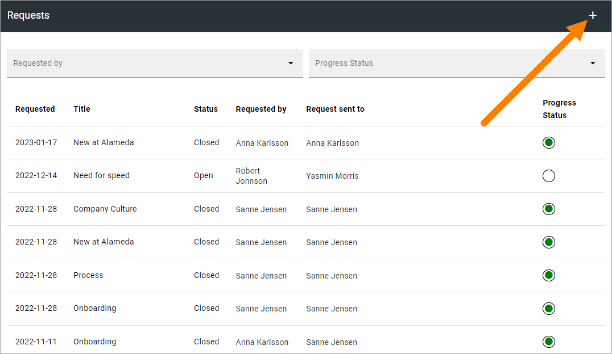
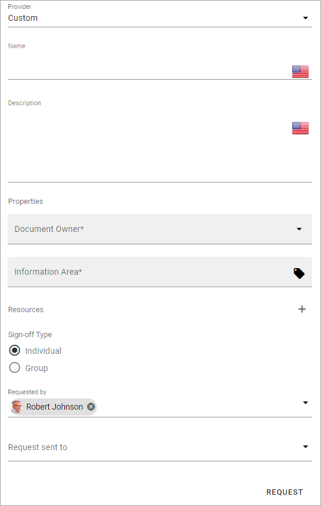
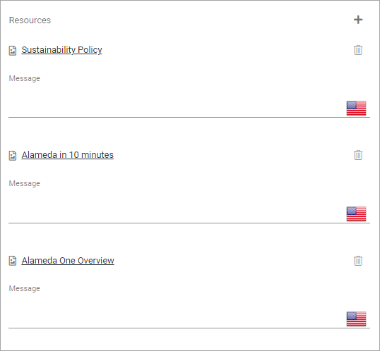
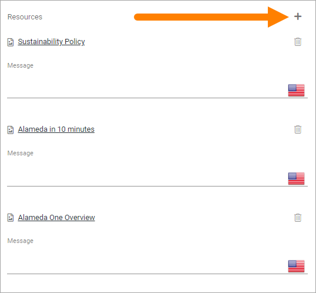
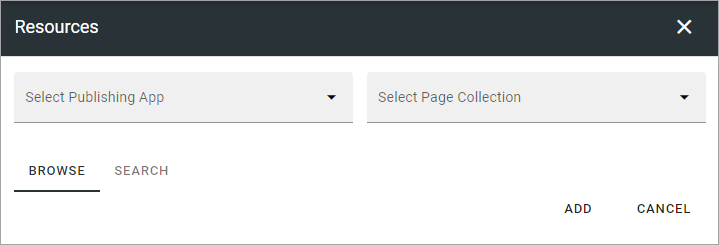
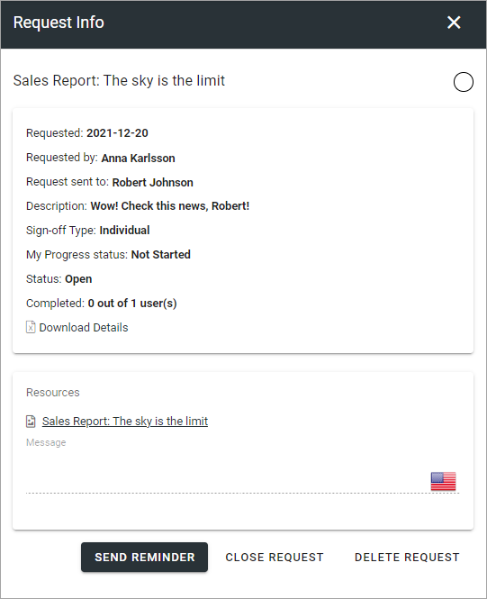
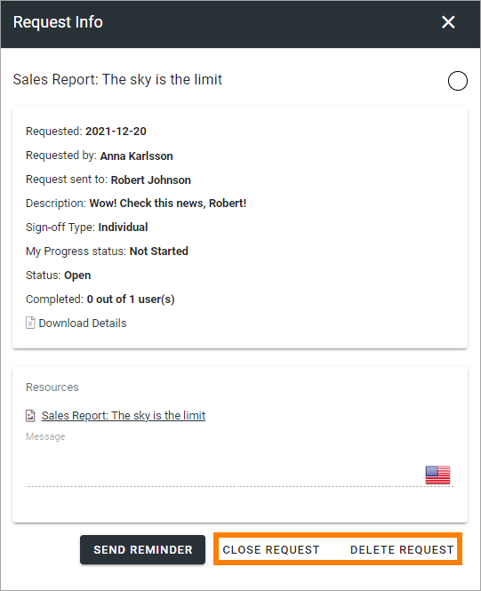

Requests
=============================================

**There are still some details that will be added/edited in this description. Will be finished in a few days.**

All created requests are listed here. You can filter on "Requested By" and "Progress Status" (In Progress or Completed).

Here's an example of a list from a test environment:

.. image:: sign-off-requests-requests-613.png

The "Status" column indicates if the request is open or closed. the "Progress Status" column to the right indicates the number of answers; white for none, yellow for some/ongoing and green for all that the request was sent to.

For more details and the possibiblty to delete a request, click the link (Name).

Create a new request
***********************
To create a new request, do the following:

1. Click the plus.

2. Use the following settings:

+ **Custom**: Here you can choose to create a Custom Sign-off Request or use a template. 
+ **Template**: Available when "From Template" is selected above. Lists all available Sign-off Request templates, if any. Select template here.
+ **Name**: Add a name for the request here, in any of the tenant languages (click the flag to chance language).
+ **Description**: You can add a description of the request here, in any of the tenant languages (click the flag to chance language).
+ **Properties**: (A description will be added soon).
+ **Resources**: Here you add the pages that should be signed off, using the Page Picker. If you selected a template, the list of pages will most likely be pre populated with a number of pages. You can add or remove pages as needed. See below for more details.
+ **Sign-off Type**: Select if this is a request that will be sent to just one colleauge (Individual) or to e group.
+ **Requested by**: Add one or more users that will be shown as the "sender" of this request. Must be persons, can not be a group. Will be shown to the receivers. Your name will be pre populated but it can be removed. This field must always contain at least one name though. 
+ **Request sent to**: Select one or more users or groups to send the request to by e-mail - depending on what you selected under "Sogn-off Type". Single users, Security groups and Microsoft 365 groups can be added here (In Omnia on-prem, Microsoft 365 groups can’t be used). Note that the maximum number to send to can be set under "Settings". This field is mandatory or the request can not be saved, but it can of course be edited later.

3. Add or remove pages as needed.
4. Add a message for each page, if needed (for more information, see below).
5. Click REQUEST to save the Sign-off request and send it. If you don't, nothing is saved.

To add or remove pages
----------------------------
Here's how to add or remove pages for a Sign-off Request. It works the same with a template or without.

If you use a template, this list will be pre populated, for example:

You can add a message (not mandatory) for each page, if needed, using the field below the page name, in any or all tenant languages. As always, click the flag to change language.

To remove a page from the list, click the dust bin (this does not affect the template). To add additional pages, click the plus.

The following is shown:

You can now Navigate and Pick (Browse) or Search, the same way as in the Page Picker (it's a part of the Page Picker that is used here). See this page for more information: :doc:`The Page Picker </general-assets/page-picker/index>`

Here you click ADD when you have selected one or more pages to add to the Sign-off Request.

Checking up on a request
*************************
You can check up on a Sign-off request to see what has happened.

1. Click the link (Name) for the request.

Something like the following is shown, example from a test environment:

Here you can see, for example, the status and how many has completed the request. If a message has been added to any of the pages, you can also see the messages here (not added in this example).

For more information, you can click "Download Details" to download an Excel file.

Additionally, you can send a reminder to all participants.

Close or delete a request
****************************
You can close a request that should no longer be active. You can delete a request no longer need.

When you close a request, you can choose to send an email to those that has not completed the request:

.. image:: sign-off-requests-checking-2-613.png

A closed request can be reopened, a deleted request can (of course) not.

Sign-off Requests Rollup block
*********************************
There's a block available to be used for listing the Sign-off Requests that is sent to the logged in user or a group that the user belongs to.

More information about the block is found here: :doc:`Sign-off Requests Rollup </blocks/sign-off-request/index>`

