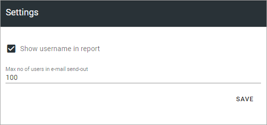

Settings
===============================

The following settings are available here:

+ **Show username in report**: If user names should not the shown in sign-off reports, deselect this option.
+ **Max number of users in Email send-out**: Decide the number of Emails to be sent. This setting will be used when requests are sent to a group that is not Email enabled. The administrator sending the request may be alerted to add Email addresses. If requests are sent to a group that is Email enabled, there is nothing to consider and this setting is ignored.

