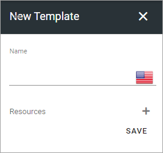
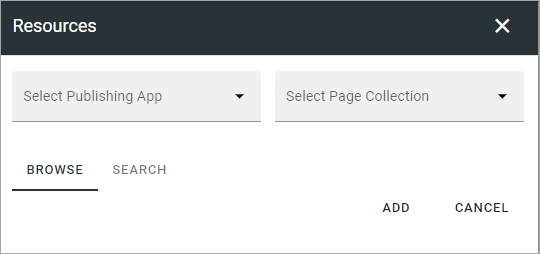
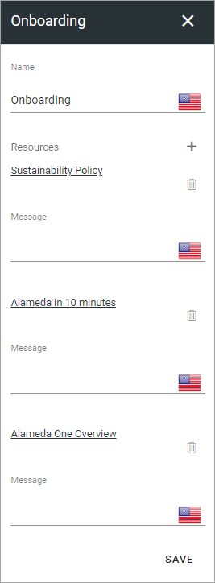

Templates
=============================================

Here you can work with templates for Sign-off Requests. A template consists of one or more pages that should be read and signed off. A template can then be used to create Sign-off Requests, where pages from the template can be removed, and additional pages added, if needed.

.. image:: sign-off-requests-templates-new2.png

To edit a template, click the pen, to delete, click the dust bin.

Create a new template
*************************
To create a new template, do the following:

1. click the plus.

.. image:: sign-off-requests-templates-clickplus-new.png

2. Use these options:

3. Add a name for the template in any of the tenant languages (click the flag to change language).

4. Click the plus to add pages.

This is then shown:

You can now Navigate and Pick (Browse) or Search, the same way as in the Page Picker (it's a part of the Page Picker that is used here). See this page for more information: :doc:`The Page Picker </general-assets/page-picker/index>`

5. Click ADD when you have selected one or more pages to add to the Sign-off Request.
6. Repeat adding pages until all pages you want in the template is in place.
7. Add a message for any of the pages, if needed. The messages can be edited when the template is used,

Here's an example of a template with a number of pages and the fields where you can add messages.

8. Click SAVE to save the template.

