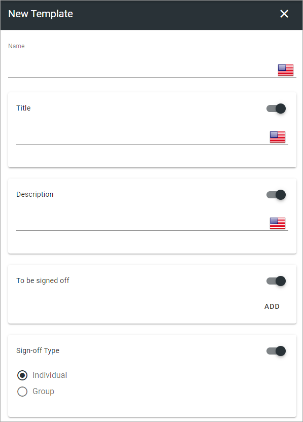
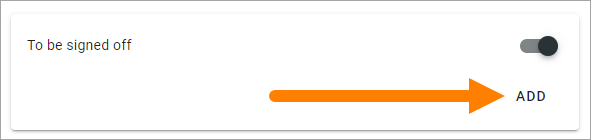
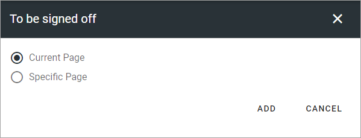
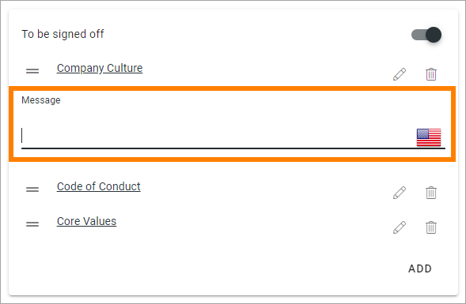

Templates
=============================================

Here you can work with templates for Sign-off requests. A template can then be used in a type. When creating Sign-off requests a rype is always used, where pages from the template can be removed, and additional pages added, if needed.

.. image:: sign-off-requests-templates-new2.png

To edit a template, click the pen, to delete, click the dust bin.

Create a new template
*************************
To create a new template, do the following:

1. click the plus.

.. image:: sign-off-requests-templates-clickplus-new.png

2. Use these options:

and these:

.. image:: sign-off-requests-templates-options-613-2.png

3. Add a name for the template in any of the tenant languages (click the flag to change language).

4. Decide what settings should be possible to edit when the template is used to create a type, by activating/deactivating sections.

.. image:: sign-off-requests-templates-sections.png

5. Use the following possible settings:

+ **Title**: A title can be shown for the request and if activated (default) you can add a suggested title. Click the flag to change language.
+ **Descriptiopn**: A descriprion can be shown for the request and if activated (default) you can add a suggested description. Click the flag to change language.
+ **To be signed off**: Here you add pages that should be read and signed off. See below for more information.
+ **Sign-off type**: Select how the sign-off request will be handled. If you select “Individual”, all users added to “Request sent to” will receive a personal request. Everyone has to sign-off individually. If you select “Group”, it works as one group request, meaning it’s enough that any one of the recipients signs-off the request. All other recipients can see that the request was sent to them and can see if someone in the group has signed off, they can see if the task is done or not.
+ **Requested by**: Add one or more users, or groups, that will be shown as the “sender” of this request. Will be shown to the receivers. Your name will be pre populated but it can be removed. This field must always contain at least one person or group. To add several users or a group here can be useful, then all users, or the whole group, will be able to follow up on the request. 
+ **Request sent to**: Select one or more users or groups to send to. Single users, security groups and Microsoft 365 groups can be added here (In Omnia on-prem, Microsoft 365 groups can’t be used). 

6. Save when you're done.

Add pages to be signed off
---------------------------
Here's how to add pages to be signed off:

1. Click ADD.

2. Choose "Current page" or a "Specific page".

If you select "Current page" the actual page where the sign-off request is placed can be signed off, wherever that is.

When you select "Specific page", continue like this:

3. Navigate and pick (Browse) or search for pages, the same way as in the page picker (it's a part of the page picker that is used here). See this page for more information: :doc:`The Page picker </general-assets/page-picker/index>`

5. Click ADD when you have selected one or more pages to add to the Sign-off request.

The selected pages are now added to the section, for example:

.. image:: sign-off-requests-pages-section.png

To remove a page from the list, click the dust bin.

6. If you would like to add a message about a page, click the pen and add the message.

7. Repeat adding pages the same way until all pages you want in the template are in place.

8. Click SAVE to save the template.

