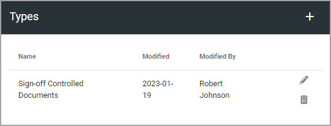
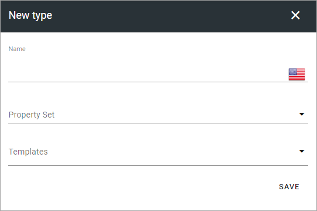

Types
=============================================

**This page is being worked on. Will be finished soon.**

Use this option to create, edit or remove types used for sign-off requests.

If you have created any, they will be listed here:

Create a new type
*********************
Do the following to create a new type:

1. Click the plus.

.. image:: sign-off-types-clickplus.png

2. Use the following settings:

+ **Name**: Add a name in any, or all the tenant languages. Click the flag to change language.
+ **Property ser**: Select property set to be used for this type. You can find information on how porperty sets work here: :doc:`Property sets </admin-settings/tenant-settings/properties/property-sets/index>`.
+ **Templates**: Select template from the list here.

3. Save when you're done.

