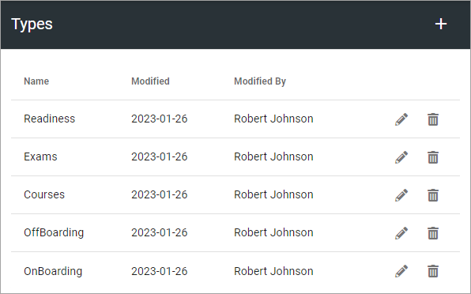
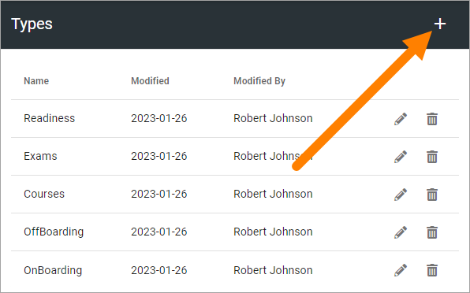
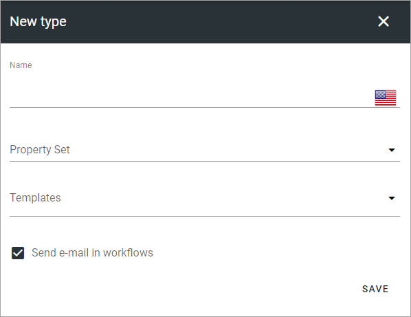

Types
=============================================

Use this option to create, edit or remove types used for sign-off requests. A type is used to decide the property set available when creating a request. 

It works a bit differently depending on if one or several types are cretaed here. If just on type is created, it's used for all requests and there's simply no way to choose type when a request is created. If more than one type is created, it's mandatory to select type for the request.

If you have created any, they will be listed here:

Create a new type
*********************
Do the following to create a new type:

1. Click the plus.

2. Use the following settings:

+ **Name**: Add a name in any, or all the tenant languages. Click the flag to change language.
+ **Property set**: Select property set to be used for this type. You can find information on how property sets work here: :doc:`Property sets </admin-settings/tenant-settings/properties/property-sets/index>`.
+ **Templates**: Select one or more templates where this type should be used.
+ **Send email in workflows**: If sign-off requests should be sent as emails, keep this option selected. If deselected, no emails will be sent at all regarding sign-off requests. 

3. Save when you're done.

