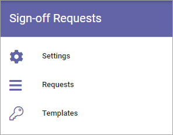

Sign-off Requests
====================

Sign off Requests can be used for read receipts for pages, including news. One example of implementation is pages a new employee should study.

The following settings are available here:

Select section for more information:

.. toctree::
   :titlesonly:

   settings/index
   requests/index
   templates/index

A rollup block for Sign-off Requests, so managers and aministrators can keep track, will also be available: :doc:`Sign-off Requests block </blocks/sign-off-request/index>`

