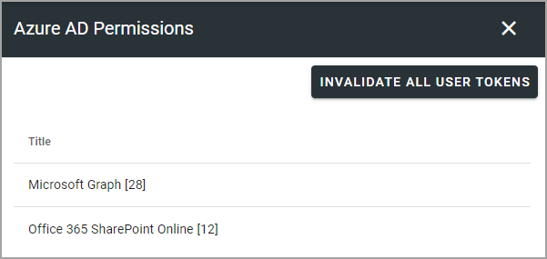
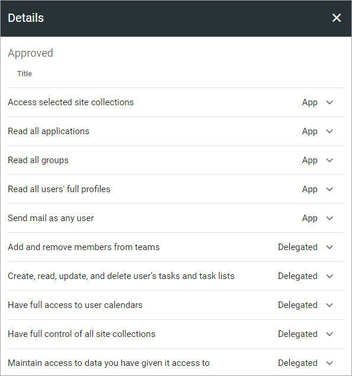

Azure AD permissions
=====================================

Here, a Tenant Administrator can see lists of all consented permissions for Omnia in Azure AD.

+ **INVALIDATE ALL USER TOKENS**: When permissions for Omnia has been changed, users needs to log out and log in for the changes to take effect. You can click this button to force a log out from Omnia for all users. More information on this below.
+ **Microsoft Graph**: Select to see a list of Microsoft Graph consented permissions for Omnia.
+ **Office 365 Sharepoint Online**: Select to see a list of the permissions Omnia requests in Microsoft 365.

Here's an example of the MS Graph list:

More on Invalidate all user tokens
******************************************
If the button INVALIDATE ALL USER TOKENS is clicked to force a log out from Omnia for all users, only Omnia is affected, not Sharepoint, Office apps, mail or anything else outside Omnia.

If an editor or author is working on a page in Omnia, the user will be logged out but content added to a page, even if it's not published, is automatically saved quite often, to minimize content lost.

