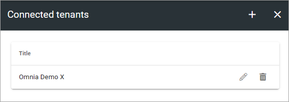
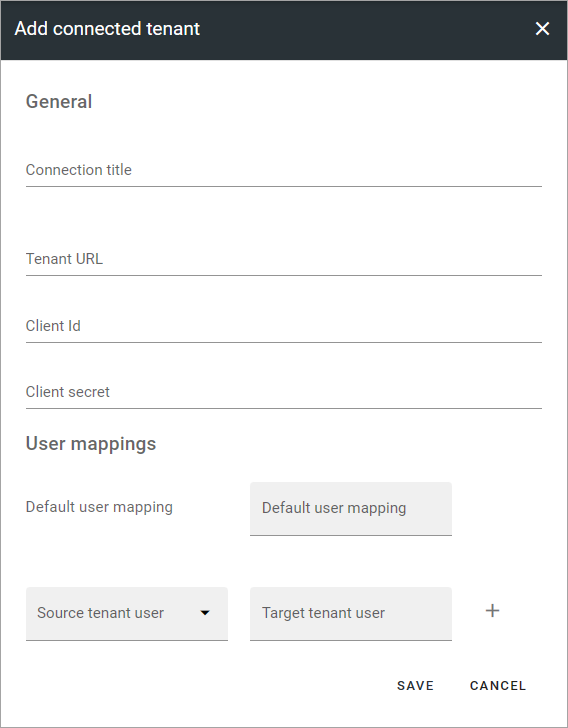
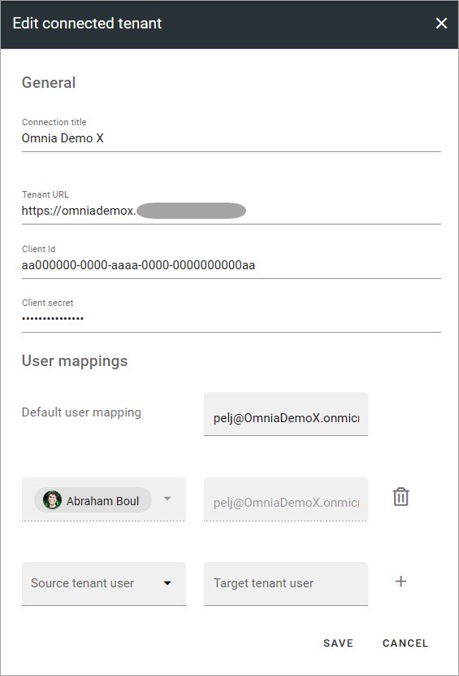

Connected tenants
=============================================

Use this option to register tenants that should be available to select when using automatic page creation.

You can find more information about automatic page creation on this page: :doc:`Automatic Page Creation </pages/automatic-page-creation/index>`

Also note that when using this option, enterprise options and variations may need to be mapped. This is done during the publication process.

If any tenants are registered here, they will show up in this list, for example:

Use the pen to edit the settings, the dust bin to delete. When editing, all settings described below can be edited.

**Important note!** Connecting a new tenant requires in-depth knowledge about Omnia and your organization's system. It should only be done by an experienced administrator.

Connecting a new tenant
*******************************
To connect a new tenant, click the plus. When you do so, the following settings are available.

Regarding user mapping - it's needed for meta data, to display for example Created by. It's mandatory to add a default user. Specific users can also be mapped. Also note that all permissions in the receiving tenant apply. These settings doesn't change anything in that respect.

Here's an example of settings, for reference:

