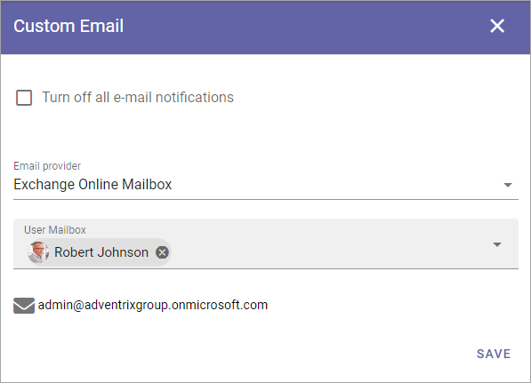

Email Service
=======================

Use these settings to decide if e-mails should be sent from Omnia or not.

+ **Turn off all email notifications**: If you select this option, no e-mails are sent from Omnia at all. If this option is enabled (ie not turned off) e-mails will be sent using the provider you choose. 
+ **Email Provider**: Select "Sharepoint Outgoing Mail" or "Exchange Online Mailbox". 
+ **User Mailbox**: If you choose Exchange Online Mailbox as the provider, select the actual user mailbox that will used. Below this the mailadress for the sender, that users will see, is noted. If you select "Sharepoint Outgoing Mail", this field is not shown as the Sharepoint mailbox is used, which no answers can be sent to.

**Note!** The selected user account need to have a cloud Exchange mailbox.

**Note!** This option is not available in Omnia on-prem.
