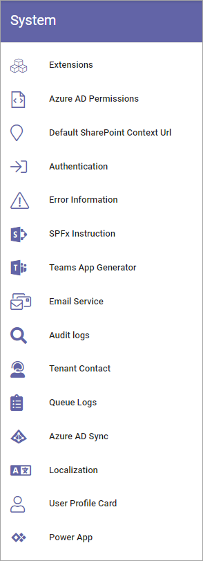

System
=============
Here, the following can be set in Omnia 6.11 and earlier:

Select section for more information:

.. toctree::
   :titlesonly:

   audit-logs/index
   authentication/index
   azure-ad-permissions/index
   azure-ad-sync/index
   default-sharepoint-content/index
   custom-email/index
   error-information/index
   extensions/index
   localization/index
   power-apps-tenant/index
   queue-logs/index
   spfx-instruction/index
   teams-app-generator/index
   tenant-contact/index
   user-profile-card/index

In Omnia 6.12, this menu has been reorganized, see: :doc:`System settings in Omnia 6.12 </admin-settings/tenant-settings/system-612/index>`

