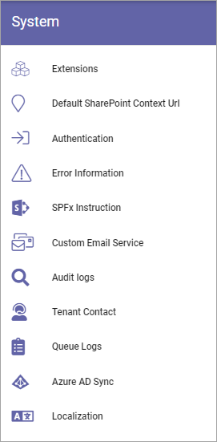

System
=============
Here, the following can be set:

Select section for more information:

.. toctree::
   :titlesonly:

   audit-logs/index
   authentication/index
   azure-ad-sync/index
   custom-email/index
   default-sharepoint-content/index
   error-information/index
   extensions/index
   localization/index
   queue-logs/index
   spfx-instruction/index
   tenant-contact/index
   
In Omnia 6.5 a new option will be added to this menu (click for an introduction):

.. toctree::
   :titlesonly:

   user-profile-card/index

